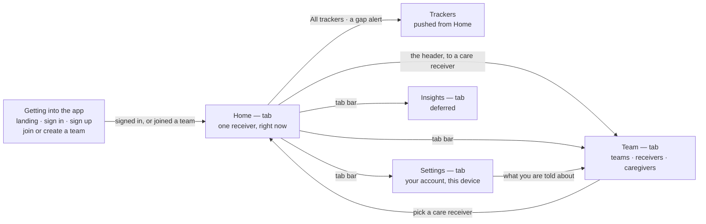

# Product Requirements

## About this document

This document is the authority on what the product is. When it and the built app disagree, the
document is right and the app is what changes: it describes the target state rather than the current
implementation, and much of it is deliberately ahead of what exists. Decisions about scope,
behavior, and vocabulary are settled here first, and anything built is expected to answer to it.

It stays high level on purpose. It covers the problem being solved, the goals, the shared vocabulary
the team uses to talk about the domain, and the experiences a caregiver moves through — never files,
functions, endpoints, or the internals of any client. Those live in the repository, change far
faster than the product does, and would make this document wrong within a week of being written.

What is unresolved is recorded rather than hidden. Each flow ends with the gaps in it, so a path
nobody has thought through is visible instead of being discovered mid-build, and the open questions
at the end hold the decisions still to be made.

## Problem Statement

When someone requires care, multiple caregivers often share responsibility and need to coordinate.
Each caregiver needs a way to log the care they provide and stay informed about what others are
doing, but every care receiver is different. Therefore, caregivers only want to track what's relevant
to that person. Today, caregivers have no easy way to visualize or make sense of the care being given
over time, or to connect it to what's happening in the care receiver's life.

## Goals

- Caregivers have a central place to organize and track the care they give to shared care receivers
- Caregivers gain insight into the care receiver's life through trends and charts
- Caregivers receive reminders about upcoming care and alerts when logged values fall outside their
  expected range
- Caregivers feel confident they're not duplicating effort or missing important care, even when
  multiple people are involved

## Definitions

**Caregiver** — A person who helps care for a care receiver and logs entries about that care. Every
member of a care team is a caregiver; a caregiver can belong to more than one care team.

A caregiver can close their account. Doing so takes away the person — their name, their address,
their way back in — but not the care they recorded: every entry and journal note they wrote keeps its
values, its time, and its place in the timeline, and the name against it becomes **a former
caregiver**. The record belongs to the care receiver and the team rather than to whoever typed it,
and no family should lose six months of readings because the person who took them left. What is
removed is the caregiver; what stays is the care.

**Care receiver** — A person who is being cared for, and about whom entries are logged. Each care
receiver has a time zone, and every wall-clock rule about them is expressed in it: when a schedule
fires, when a scheduled entry is due, when it becomes missed, and where one day ends and the next
begins. Caregivers always see a receiver's times in that zone, whatever zone they are themselves in,
so everyone on a team calls the evening dose by the same name. If a receiver's time zone changes —
they move, or spend the winter somewhere warmer — their routines keep their wall-clock times and
shift with them, because an 8:00am dose is a dose taken after waking up, not a dose taken at a
particular instant.

**Care team** — A shared space containing one or more care receivers and the caregivers who look
after them. Every care receiver, tracker, and entry belongs to exactly one care team.

A caregiver joins by invitation and may leave at any time; leaving takes away the access and not the
record, so every entry and journal note they wrote stays exactly where it was, under their name. A
team always has at least one admin, and nothing anyone does may leave it without one — the last
admin cannot demote themselves, leave the team, or close their account until someone else has been
promoted. A team with no admin could never invite a caregiver, add a receiver, or make a tracker
again, and no path inside the app leads back out of that.

**Admin** — A role held by one or more caregivers on a care team. Admins invite and remove
caregivers, promote other caregivers to admin and demote them again, and manage the team's care
receivers, trackers, care instructions, and coverage. The caregiver who creates a care team is its
first admin. Every caregiver logs entries and can see who else is on the team and what role they
hold; admins additionally manage the team's setup.

**Invitation** — How a caregiver joins a care team. An admin creates an invitation for a particular
email address and role, then shares it with that person however they already talk to them; the app
does not send email on their behalf.

There are two ways to redeem one, and the common one asks nothing of the invitee. A caregiver who
signs up with the address they were invited at finds the invitation waiting in the app and accepts
it — no code, no link, nothing to carry between two apps. For when that address will not work —
someone uses Apple's Hide My Email, or signs up with a different address than the admin had on hand
— every invitation also carries an **invite code** the admin copies and sends, and the invitee
pastes into the app, so a wrong guess at someone's email is a small annoyance rather than a dead
end. The code is long and random rather than short enough to read aloud, because it is always
copied: nobody should be able to reach a care team by guessing. An admin can copy it again from the
team's pending invitations for as long as it goes unused. **Admin-role invitations are the
exception: they must be accepted from the invited address**, because promoting someone to admin
should not be possible by passing a code along. An invitation is single-use and expires after two
weeks, so a code shared once does not stay live.

**Assignment** — A span of time during which a named caregiver is responsible for a care receiver.
Assignments are how a care team answers "who has Thursday?": they make coverage visible so two
caregivers don't both drive over, and so time nobody is covering is something the team can see
rather than discover afterward. An assignment is a coordination signal, not a permission boundary —
every caregiver can log entries for any receiver on their team at any time, whether or not they are
assigned, and nothing about reminders or alerts depends on who is on duty. Assignments can overlap,
since a family member and a paid aide are often present together, and time nobody is assigned to is
simply uncovered. An assignment covers a care receiver as a whole, not particular trackers.

Coverage is optional. Many teams coordinate informally and never need a roster; a team that keeps
none simply has no assignments, and nothing else in the app changes. Admins manage the roster —
creating, changing, and reassigning a team's assignments and coverage schedules.

**Coverage schedule** — A recurring rule that generates assignments, such as "Trevor, every Tuesday
8am–4pm". A care receiver can have any number of coverage schedules, which is what lets a team
describe a real rotation. A schedule can end on a set date, so a temporary arrangement stops on its
own. A single generated assignment can be handed to another caregiver without touching the rule
behind it, so covering one Tuesday for someone does not rewrite the routine.

**Care instructions** — A written description of how to care for one care receiver, kept by the
team's admins and readable by every caregiver. It holds the standing knowledge no tracker can: that
the morning pills go down with food, that the walker comes along for anything past the kitchen, that
the hearing aid goes in before anyone tries to talk. A care receiver has one set of instructions, and
they belong to the receiver rather than the team, because two receivers on the same team are cared
for differently.

The instructions are a single free-form document an admin writes in their own words — no list, no
categories, no fields — because care is described in sentences, and an app that asks which category
something belongs to is an app where somebody stops writing. The document records who last changed
it and when, so a caregiver reading it at 2am can tell standing orders from something written a year
ago and never revisited.

Beside the document is a list of **emergency contacts**: each a name, a relationship, and a phone
number, held as real fields rather than typed into the prose, so a caregiver can call straight from
the screen instead of picking a number out of a paragraph while something is going wrong. A receiver
can have any number of them, in the order the admin sets, or none.

Admins write both; every caregiver reads them. Care instructions are reference, not activity —
nothing is logged against them, and they never appear in a timeline or an insight.

**Tracker** — Something a care team wants to keep track of about one care receiver — blood pressure,
meals, mood, medication given. A tracker has a name, icon, and color, and defines the fields captured
each time it is logged. A tracker belongs to a single care receiver, so two receivers on the same
team can be tracked differently.

A tracker can be **paused** when a team stops tracking something — the blood pressure taken daily for
a month after a hospital stay, the pill that came off the regimen. Pausing stops the future without
touching the past: no new entries can be logged against it, its schedules stop generating, its
thresholds stop raising alerts, and it leaves both Home and the logging picker. Everything already
logged stays exactly where it was, in the timelines it appeared in and the insights it fed, where the
series simply ends on the day the team stopped collecting. Care that happened is not undone by a
decision made afterward — and a team that had to erase a month of readings in order to stop taking
them would keep the tracker instead and quietly stop using it, which serves nobody. A pause carries
no promise that the tracker comes back: it is called a pause because the door stays open, not because
anyone has to walk back through it. Admins pause and resume trackers, and a resumed tracker returns
with its history intact.

**Field** — One piece of data a tracker captures, such as "Systolic" (a number, in mmHg) or "Mood" (a
choice from a list). A field holds a number, free text, a yes/no, a choice from a fixed list, or a
date and time, and is either required or optional. A tracker has zero or more fields; a tracker with
no fields records only that the thing happened. Field type decides which insights are available:
numbers plot as values over time, while choices and yes/no plot as frequency.

A field can also be **paused**, which stops it being collected without removing what it collected. A
paused field drops off the logging form, so caregivers are no longer asked for it, but its values
stay on every entry already carrying them and still plot in insights, where the series ends on the
day it was paused. This is the same thing one level down and for the same reason: a team that stopped
taking a pulse alongside the blood pressure has not stopped having taken it. A paused field resumes
where it left off. A field is never deleted, because deleting one would take real readings with it.

**Threshold** — An optional expectation on a tracker, in one of two forms. A **range** on a numeric
field — an expected low and high, such as 90/60 to 140/90 for blood pressure — raises an alert when a
logged value falls outside it. A **gap** on the tracker as a whole — the longest the team is willing
to go without logging it, such as three days for a shower — raises an alert when that long passes
with no entry at all.

The two forms catch opposite failures: a range notices care that happened and went wrong, a gap
notices care that never happened. A gap is the only expectation available to a tracker with no
fields, which records nothing but that the thing occurred, and it is how a team watches care that
should happen regularly without pinning it to a clock. A tracker that has never been logged counts
from the day it was created, so a gap starts watching immediately rather than waiting for a first
entry.

A tracker has schedules or a gap, never both. Care a schedule already plans is watched by missed-care
alerts, and one lapse should never be reported by two mechanisms — so choosing one means giving up
the other, and an admin changing either is told what they are about to lose.

**Tracker template** — A pre-built tracker definition — name, icon, color, fields, and thresholds —
that a caregiver can add in one step instead of building a tracker from scratch.

**Entry** — A record attached to a tracker: its field values, an optional note, and a time. Every
entry is in one of four states:

- **Scheduled** — planned for a future time, not yet logged.
- **Logged** — a caregiver logged it, so it carries the time it occurred and who logged it.
- **Missed** — its scheduled time has passed and no caregiver has logged it yet.
- **Skipped** — a caregiver deliberately marked it as not happening, whether or not its time has
  already passed, and the entry carries who skipped it and when. A skip is a decision, not a care
  failure, so it never counts as missed — and a decision has an author for the same reason a logged
  entry does.

A caregiver logging an entry is what moves it to logged; the passage of time alone never does, so the
app never records care that nobody gave. Missed is not a final state: care often happens without
being logged right away, so a caregiver can log a missed entry at any point afterward and set the
time the care actually occurred — someone catching up on the week during the weekend should not have
to record it as never having happened. A missed entry can equally be skipped, and skipping settles
it: the entry becomes skipped rather than carrying both states, because a caregiver saying the care
was not needed is making a decision whatever hour they make it in. Settling is not the same as being
final: a caregiver who skipped the evening dose and then learns it was given after all can edit the
entry and log it, moving it from skipped to logged and putting the care back in the record — a skip
is a judgement about what happened, and a judgement made on wrong information should be correctable
by whoever turns up the right information. Only planned care can be skipped, since an entry logged
ad hoc records care that already happened and there is nothing left to decide about it. Entries are
the raw material for every insight in the app, and — with journal notes alongside them — for every
timeline.

Any caregiver can edit or delete any entry, whoever logged it, because a family that shares the care
of one person shares the record of it too — and the caregiver who notices a systolic reading is a
digit short is rarely the one who typed it. An entry records who logged it and, if it has since been
changed, who changed it last and when, so a caregiver reading a value with someone's name against it
can tell whether it is still what that person logged.

Deleting an entry that fulfilled a scheduled one does not delete the plan behind it: the occurrence
goes back to scheduled, or to missed if its time has passed. Logging is what makes an entry logged,
so undoing the log undoes exactly that and no more — a caregiver who logged the evening dose against
the wrong receiver should be left with an evening dose still waiting, not with an evening that was
never planned. An entry logged ad hoc fulfilled nothing, and deleting it simply removes it. The same
holds for a skip: deleting one returns the occurrence to waiting rather than erasing it. Editing a
skipped entry into a logged one says the care happened after all, while deleting the skip says only
that it should not have been skipped — and a caregiver who marked the wrong dose needs the second
without having to claim the first.

**Scheduled entry** — An entry planned for a future time, such as an upcoming appointment or a dose
due this evening. Scheduled entries are what the app looks ahead to and reminds caregivers about.
They can be created one at a time or generated by a tracker schedule. One made by hand carries
whatever can be filled in ahead of it — the dose, which pills — the same as one a schedule generates,
and leaves blank only what nobody can know until the care happens. A scheduled entry becomes
logged only when a caregiver deliberately logs it — either by opening it directly, or by accepting
the app's offer to fulfill it when an ad-hoc log lands near one. The app never attaches a log to a
scheduled entry on its own, so this morning's dose can never be mistaken for yesterday's. A scheduled
entry's time comes from its schedule and is not moved on its own — a schedule that bends occurrence
by occurrence stops describing the routine it exists to describe. If the care happens at a different
time, the caregiver logs the occurrence with the time it actually occurred; if it will not happen at
all, they skip it.

**Tracker schedule** — A recurring rule on a tracker, together with the field values it pre-fills,
that generates scheduled entries. A tracker can have any number of schedules, which is what lets one
tracker describe a real regimen: a morning dose and a different evening dose, or one set of
medications on Monday, Wednesday, and Friday and a different set on Tuesday and Thursday. A schedule
can optionally end on a set date, so a course of treatment stops on its own. Each schedule has a
label a caregiver may type; left blank, it defaults to one derived from the schedule itself, such as
"Med A — MWF, 8:00am". A tracker does not need a schedule at all; entries can always be logged ad
hoc.

**Journal note** — Something a caregiver wants to say about a care receiver's day that no tracker
captures: that the morning was rough and breakfast went half eaten, that a granddaughter visited and
the mood lifted for the rest of the afternoon, that the new pills seem to make the evenings foggy. A
journal note is free-form prose with a time and an author, and any number of them can be written
about one day by any number of caregivers.

Journal notes exist because care worth knowing about is not always care that can be counted. Turning
something into a tracker means deciding in advance which parts of it matter enough to become fields,
and an app where every observation has to clear that bar first is an app where most observations are
never written down at all.

They sit in the daily timeline in time order among the entries logged that day, because the reason
to write one is that the next caregiver reads it. A note carries the time it is about rather than
the time it was typed, so a caregiver writing up Tuesday on Wednesday morning puts it where it
belongs. Writing one notifies nobody: reminders and alerts are both about the clock — care that is
coming, care that went wrong — and a journal note is neither. It is found by reading the day rather
than by interrupting anyone, because a note that reached five phones the moment it was typed is a
note people would think twice about writing.

Every caregiver writes journal notes, and any caregiver can edit or delete any of them, on the same
reasoning as entries. A note records who wrote it and, if it has since been changed, who changed it
last and when, so a caregiver reading words with someone's name against them can tell whether they
are still that person's words. Journal
notes are not entries: they attach to no tracker, have none of an entry's four states, and are never
plotted — free text has no shape an insight could take, and a day with three notes in it was not a
day with more care in it.

**Reminder** — A notification that a scheduled entry is coming up.

**Alert** — A notification that something needs attention: a logged value fell outside its range, a
tracker went longer than its gap without an entry, or scheduled care was missed. Missed-care alerts
are optional and set on the schedule or one-off scheduled entry they apply to, since not all care
warrants one — a missed dose matters, a missed walk may not. Reminders look ahead; alerts look
back.

**Notification** — How a reminder or an alert reaches a caregiver. Two channels carry them: a push
notification to the device, and email. Push is granted or refused by the phone rather than by the
app, so the app reports what the phone has decided instead of claiming to control it — a switch
reading "on" while the phone is silently refusing is worse than no switch. Email is the app's own and
can be turned off.

A caregiver picks their channels once, for their account, because how someone wants to be reached
does not change from one care team to the next. What they want to be told about does change, and that
belongs to each care team separately.

**Insight** — Any visualization of a tracker's entries. A chart of blood-pressure readings over time
is an insight; so is a trend line, or a count of how often something happened. Insights are derived
from logged entries only — scheduled entries are excluded until a caregiver logs them, so nothing
planned is ever plotted as though it happened. Journal notes are not plotted at all: they hold prose
rather than values, and there is nothing in them to chart.

## UX flows

The app is five areas. Each gets a subsection below holding three things: prose for why the area is
built the way it is, a **Screens** catalogue stating every screen it owns, and the gaps still open in
it.

Every screen appears in exactly one catalogue, once. A screen reached from three places is still one
entry, because it is one screen; where it is reached from is answered by the other screens' exits.
The catalogues are written as data rather than prose so that they can be checked mechanically — that
every destination names a screen that exists, that no screen is unreachable, and that none is a dead
end. Each entry holds:

| Field      | What it says                                                                  |
| ---------- | ----------------------------------------------------------------------------- |
| `screen`   | Its name, unique across the whole app.                                        |
| `kind`     | How it is presented: `tab`, `push`, or `sheet`.                               |
| `scope`    | What it is about, and what reloads when that changes.                         |
| `contains` | What is on it.                                                                |
| `exits`    | Every action that leaves it (below).                                          |
| `empty`    | What it shows when there is nothing to show. Omitted when it cannot be empty. |
| `open`     | Questions nobody has answered. Every one has a bullet under that area's gaps. |

An exit is `action` (what the caregiver does), `to` (where it goes), and `as` (how). It carries `when`
if it depends on a condition, and `admin: true` if only admins see it. An exit has exactly one
destination — a choice between two is two exits with different `when`, because an implementer cannot
build a single arrow that points at two screens.

`as` is the part a diagram never tells you, and it is what decides what "back" does:

| `as`    | What happens                                            | How you get back                         |
| ------- | ------------------------------------------------------- | ---------------------------------------- |
| `push`  | A new screen on top of the stack.                       | A back button.                           |
| `sheet` | A card over the current screen, which is never lost.    | Dismiss, landing on what raised it.      |
| `swap`  | Replaces the current screen rather than stacking on it. | Nothing — there is deliberately no back. |
| `stays` | Nothing navigates; the screen updates where it stands.  | N/A.                                     |
| `tab`   | Switches tabs. The stack you left is preserved.         | The original tab, where you left it.     |
| `root`  | Discards the whole stack and starts again.              | Nothing — there is no stack left.        |
| `out`   | Hands off to something outside the app.                 | iOS's business, not the app's.           |

`???` marks something nobody has decided. It is a correct entry, not an unfinished one.

The areas hand off to each other at a small number of points:



Home, Team, Settings, and Insights are the four tabs. Trackers has no tab of its own and is pushed
from inside Home, because it is about one care receiver and Home is where a receiver is being looked
at. **Insights is deferred** and its catalogue is a placeholder, so that nothing points at a screen
this document does not describe.

### Getting into the app

Everything before Home: creating an account, signing back in, and landing somewhere once the app
knows who you are.

Reaching **signed in** is not quite the end. It is a resolution rather than a screen: the app settles
the caregiver's identity and care teams there, and that is what decides where they land — Home if
they belong to a care team, Join a care team if they do not. The same resolution runs at launch, so a
returning caregiver whose session is still good goes straight to Home without passing through Landing
at all.

**Signing in.** Landing is a pure entry point: once past it, a caregiver crosses between Sign in and
Sign up directly rather than going back, which is why those two swap rather than stack. Confirm code
and Reset password are sheets over the screen that raised them, so the form underneath is never lost
— and Reset password changes in place rather than navigating, taking an email and then swapping to a
code and a new password, ending back at Sign in rather than signing the caregiver in on its own.

**A sign in that fails says as little as it can.** A wrong password and an address with no account
are answered identically — that the credentials are incorrect — because distinguishing them tells
anyone who asks which addresses have accounts on a care app, and a family's involvement in one is not
something the app should confirm to a stranger.

The one thing that is revealed is revealed only once it has been earned. An address whose account was
created but never confirmed goes to Confirm code with a fresh code, but only after the right password
has been supplied — so a caregiver learns their account exists by having already proved it is theirs.
Revealing it on the address alone would hand back exactly what the identical message was protecting.

After five failed attempts the account is locked for fifteen minutes. The lock is on the account
rather than the device, because a device lock is escaped by reinstalling and punishes a family
sharing one iPad. The screen says that the account is locked and when it will clear, rather than
repeating that the credentials are wrong — a caregiver told the same thing six times learns nothing
about why the sixth time was different. Forgot password stays available throughout, because it is a
way in that does not depend on remembering anything. Nothing about the lock needs anyone's help: it
clears on its own, because an account a family cannot get back into without an intervention is an
account they cannot get back into.

A code the app emails — to confirm an account, or to reset a password — lives ten minutes, and the
lock covers everything that issues or checks one. A locked-out caregiver cannot resend their way
around it, and Sign up cannot be used to mint a fresh code for an account that is locked, since a
lock that only guarded the screen it was tripped on would leave Sign up as a way to ask for another
code. Because the code dies before the lock lifts, five guesses is all any code ever gets. There is
also a wait between resends, so a caregiver who presses it twice does not spend two of those guesses
on a code that has already been replaced.

**Reset password is the way back in, whatever went wrong.** It answers every address identically —
that if an account exists, a code is on its way — because a screen that said otherwise would let
anyone discover which addresses have accounts, which is exactly what Sign in refuses to do. An
account created but never confirmed cannot have its password reset at all, so it is sent a
confirmation code instead and the caregiver lands on Confirm code. Confirming and then resetting is
two steps rather than one, but it is a path rather than a dead end. That this reveals an abandoned
signup is a cost taken deliberately: it exposes signups nobody finished rather than accounts somebody
holds, and Sign up already reveals the same thing about the same address.

For the same reason, Reset password answers every code that is not the right one the same way. If a
wrong code and an expired one read differently, a caregiver who was never sent a code could tell
which of the two they were, and the neutral answer to an unknown address would be undone by the
screen after it. Confirm code has no such worry and says which it was, because a caregiver only
reaches it having already shown the account exists — and being told the code expired is what tells
them to ask for another rather than retype the same six digits.

A caregiver who mistyped their address can go back to it. The code already sent is discarded and
correcting the address sends another, because the alternative is someone staring at a code field
waiting for a code that went somewhere else, with the fix two screens away.

Setting a new password ends every other session and clears the credentials stored for Face ID. A
device still holding the old password finds it rejected, clears its own copy, and asks the caregiver
to sign in — offering Face ID again once they have — so Face ID stops working loudly rather than
silently. The same holds for a password changed deliberately from Settings, where the device making
the change stays signed in, because ejecting someone from the app they are standing in is not
security. Resetting ends back at Sign in rather than signing the caregiver in, since a reset has just
destroyed every session and creating one in the same breath would undo the point of it.

**Signing up.** Confirming the code signs the caregiver in without asking for the password a second
time, so signing up ends in the same place signing in does — and a caregiver who turns out to already
have an account leaves through the cross-link rather than by going back to Landing.

An address that already has an account is answered by which kind of account it is. A confirmed one
sends the caregiver to Sign in, because signing in is what they were trying to do. One created but
never confirmed sends them to Confirm code with a fresh code, because finishing is what they were
trying to do. Saying only that the address is taken would strand the second kind at the one screen
that cannot help them, which is the trap an abandoned signup already falls into.

**Signed in with no care team.** Join a care team is where a caregiver accepts an invitation waiting
for their email or pastes an invite code, with creating a team offered as the alternative rather than
the only option. Accepting an admin-role invitation additionally requires signing in with the address
it was sent to.

Two behaviors have no screen of their own. **Remember me** stores the email address only and prefills
it on the next launch. **Face ID** is offered once, in a sheet the first time a caregiver reaches
Home on a device that supports it; from then on the credentials live in the device keychain and the
prompt comes up automatically whenever a session lapses on its own — but never after a deliberate
sign out, which is a caregiver saying they want out.

#### Screens

```yaml
- screen: Landing
  kind: push
  scope: >
    nothing; the app before it knows who you are. Shown only when no session is
    live — a returning caregiver with a good session never sees it
  contains:
    - brand and tagline
    - Sign in
    - Create account
    - contact support
  exits:
    - action: Sign in
      to: Sign in
      as: push
    - action: Create account
      to: Sign up
      as: push
    - action: contact support
      to: ???
      as: ???
  open:
    - what contact support does — mail app, web page, or a form inside the app

- screen: Sign in
  kind: push
  scope: nothing; no caregiver is known yet
  contains:
    - email, prefilled from Remember me
    - password
    - remember me
    - Face ID, when the device has it and credentials are stored
    - Forgot password?
    - Create account
  exits:
    - action: Sign in, or Face ID
      when: the credentials are right and you belong to a care team
      to: Home
      as: root
    - action: Sign in, or Face ID
      when: the credentials are right and you belong to no care team
      to: Join a care team
      as: root
    - action: Sign in
      when: the password is wrong, or the address has no account
      to: Sign in, saying only that the credentials are incorrect
      as: stays
    - action: Sign in
      when: the password is right and the account was created but never confirmed
      to: Confirm code, with a fresh code sent
      as: sheet
    - action: Sign in
      when: five attempts have failed
      to: Sign in, locked for fifteen minutes, saying so and saying when it clears
      as: stays
    - action: Forgot password?
      to: Reset password
      as: sheet
    - action: Create account
      to: Sign up
      as: swap
- screen: Sign up
  kind: push
  scope: nothing; no caregiver is known yet
  contains:
    - first and last name
    - email
    - password
    - confirm password
    - terms and privacy
    - Sign in
  exits:
    - action: Create account
      to: Confirm code
      as: sheet
    - action: Create account
      when: the address already has a confirmed account
      to: Sign in
      as: swap
    - action: Create account
      when: the address has an account that was never confirmed
      to: Confirm code, with a fresh code sent
      as: sheet
    - action: Sign in
      to: Sign in
      as: swap

- screen: Confirm code
  kind: sheet
  scope: >
    the address being confirmed; raised over Sign in or Sign up, or in place of
    Reset password when the account was never confirmed. Dismissing returns to
    the screen underneath
  contains:
    - 6-digit code sent to your email
    - the address it was sent to
    - Resend
  exits:
    - action: Confirm
      when: you belong to a care team
      to: Home
      as: root
    - action: Confirm
      when: you belong to no care team
      to: Join a care team
      as: root
    - action: Confirm
      when: the code is wrong
      to: Confirm code, saying the code is wrong
      as: stays
    - action: Confirm
      when: the code has expired
      to: Confirm code, saying the code has expired and to ask for another
      as: stays
    - action: Resend
      to: Confirm code, with a new code sent and the previous one discarded
      as: stays
    - action: dismiss
      to: the screen that raised it
      as: back
  open:
    - how long a caregiver must wait between resends

- screen: Reset password
  kind: sheet
  scope: >
    one email address; raised over Sign in, and where it ends. It changes in
    place rather than navigating — first the address, then the code and a new password
  contains:
    - email address
    - then, in place, the code sent to it and a new password
    - a way back to the address
  exits:
    - action: Send me a code
      to: >
        Reset password, now asking for the code and a new password, saying only
        that a code is on its way if an account exists for that address
      as: stays
    - action: Send me a code
      when: the address has an account that was never confirmed
      to: Confirm code, with a confirmation code sent instead
      as: swap
    - action: back to the address
      to: Reset password, discarding the code already sent
      as: stays
    - action: Set new password
      when: the code is not the right one, whether wrong or expired
      to: Reset password, saying only that the code is not right
      as: stays
    - action: Set new password
      to: >
        Sign in, not signed in, with every other session ended and stored
        credentials cleared
      as: back
    - action: dismiss
      to: Sign in
      as: back

- screen: Join a care team
  kind: push
  scope: the signed-in caregiver, when they belong to no care team
  contains:
    - invitations waiting for your email, each with its care team and your role
    - paste an invite code
    - create a team instead
  exits:
    - action: Accept an invitation
      to: Home
      as: root
    - action: paste a valid invite code
      to: Home
      as: root
    - action: paste a code that is invalid, expired, or already used
      to: Join a care team
      as: stays
    - action: Create a team instead
      to: Create your first care team
      as: push
  empty: >
    no invitations waiting — the screen is the invite-code field and the offer to
    create a team
  open:
    - an admin-role invitation opened from an address other than the one it was sent to
    - an invitation to a care team the caregiver already belongs to

- screen: Create your first care team
  kind: push
  scope: the signed-in caregiver, when they belong to no care team
  contains:
    - welcome
    - care team name
  exits:
    - action: Create team
      to: Home
      as: root
  open:
    - >
      the Home this lands on has no care receiver, and no screen describes that
      state

- screen: Offer Face ID
  kind: sheet
  scope: >
    this device; raised over Home the first time a caregiver reaches it on a
    device that supports Face ID, and never raised again. Afterwards it is a
    switch in Settings
  contains:
    - what Face ID will do
    - Enable
    - Not now
  exits:
    - action: Enable
      to: Home, with the credentials stored
      as: back
    - action: Not now
      to: Home
      as: back
```

#### Gaps in this flow

- **Only the happy path through an invitation is described.** An invite code can be expired, already
  used, meant for a team the caregiver already belongs to, or an admin invitation opened from the
  wrong address. Join a care team answers only the first two, and then only as "an error". The Team
  tab takes codes and waiting invitations too, so both screens are owed the same answers.
- **How long a resend makes you wait is unanswered.** There is a wait between resends, so that
  pressing it twice does not burn two of the five guesses on a code that has already been replaced,
  but nothing says how long it runs — and it has to be short enough that a caregiver whose first
  email went to spam does not give up.
- **Contact support leads nowhere described.** Landing offers it, which makes it the only route a
  caregiver locked out of their account has. Whether it opens the mail app, a web page, or a form
  inside the app decides whether that route works at all.
- **Creating a first care team lands on an undescribed Home.** A team made a moment ago has no care
  receiver, and what Home shows in that state is recorded as a gap under Home — but this is the flow
  that reaches it first, and a caregiver's very first look at the app is the one this decides.

### Home

Home is the landing tab and answers one question — how is this care receiver right now? Everything on
it is scoped to the **active care receiver**, and switching receivers reloads the whole screen.

It is built from what a caregiver needs, in the order they need it: what is wrong, what is coming,
what has already happened, and a way to log. Trackers appear on Home only when they need attention —
a logged value outside its range, a tracker that has gone longer than its gap without being logged,
or care that has gone missed — because a screen that lists every tracker whether or not anything is
happening teaches caregivers to stop reading it. When nothing needs attention, Home says so plainly
rather than leaving an empty space where a warning would be.
The receiver's full set of trackers is always one tap away.

Nothing on Home is dismissed. A range alert stands until a later reading comes back in range, a gap
stands until someone logs the tracker, and missed care stands until a caregiver logs it or skips it,
because what Home shows should be the state of the care rather than the state of someone's
notifications — an alert that can be tapped away is one a busy caregiver will tap away. Skipping is
one of the things that clears something from Home, and a skipped entry never returns to it: Home is
what needs attention and a skip is attention already paid. Skips live in their tracker's list, where
the record of what did and did not happen belongs.

What needs attention is ordered by how much it matters: missed care first, then readings outside
their range, then trackers past their gap — a dose nobody gave outranks a reading that is merely
high, which outranks a tracker that has only gone quiet. Home shows at most three at a time and says
how many there are altogether, because a list that can grow without limit is one a caregiver stops
reading at the top.

When a team keeps a roster, Home also names who is on duty for this receiver right now. It is a
coordination signal and nothing more — it never decides who may log an entry, and a team that keeps
no assignments simply sees nothing there, because coverage is optional and Home should not imply
otherwise.

Home holds the receiver's name with the care team, who is on duty, whatever needs attention, a
coming up banner, the daily timeline, and a link to all of the receiver's trackers. Pulling down
refreshes the whole screen.

**The active care receiver.** Who Home is about, and the trackers that belong to them.

Home has no receiver switcher of its own, and its header does not lead to one. Tapping the header
opens the care receiver — their instructions, who to call, who is meant to be there — because a
caregiver who taps a person's name is asking about that person, and the screen that answers should
not be a tab away from the screen that prompted the question.

Switching receivers belongs to Team, and the tab bar already puts Team one tap from here, so a
header that led there would only have been a second door onto a route that already exists. The care
team named in the header is context rather than a destination for the same reason. Picking a
different receiver on Team reloads the whole screen. Trackers is a handoff into its own area and a
destination here; what it holds is described in its own section.

**Needs attention.** What is wrong right now, and where each kind of trouble leads.

A reading outside its range leads to the entry that carries it, and missed care to the entry that is
waiting — both are a single entry a caregiver can act on, the first to correct or confirm the
reading, the second to log or skip the care. A gap alert has no entry to lead to, because it is
raised by the absence of one, so it leads to the tracker that has gone quiet. An entry reached this
way names the field that fell outside its range and the range it was expected to hold to, since a
caregiver arriving from an alert has to see what the alarm was about before they can decide anything
about it. The count of everything needing attention leads to the Trackers list with its filter
already on, so the three Home has room for are never the only three a caregiver can reach.

**Coming up.** What is due next.

Coming up is a pushed screen. An entry opened from it leads to the entry itself rather than to its
tracker, so what a caregiver is looking at is the thing they can act on. A reminder tapped from
outside the app lands in the same place — the scheduled entry it is about, ready to be logged or
skipped — because someone who has just been told a dose is due should arrive at the dose rather than
at a screen about it.

**The daily timeline.** What has already happened, a day at a time.

Entry detail is the one screen any entry is read on, whatever state it is in, because an entry that
is scheduled this morning and logged this evening is the same entry and should not change address
when it changes state. What it offers changes with the state rather than with where it was opened
from: a scheduled or missed entry offers Log it and Skip, a logged one offers Edit and Delete, and a
skipped one offers both: editing it logs the care, saying it happened after all, while deleting the
skip leaves the occurrence waiting again for whoever marked the wrong dose.
It names the schedule an entry came from when it came from one, so a caregiver can tell this
evening's dose from a reading somebody took because they felt like it, and it marks any value that
fell outside its range, because an alert now leads here and the screen has to answer for itself why
it was worth interrupting someone.

Editing happens in a sheet over Entry detail rather than on a screen of its own — a caregiver
correcting a digit is not going somewhere, and saving returns them to the entry they were reading
rather than closing it out from under them. Deleting always asks first, and the confirmation says
what deleting will leave behind, because the answer differs: an entry logged ad hoc is simply gone,
while one that fulfilled a scheduled entry leaves that occurrence waiting again. Only the first
leaves the screen; the second stays on it, now reading as missed. An edit that moves an entry to
another day takes the timeline with it: a caregiver who corrects Tuesday to Monday meant Monday, so
the day behind them becomes the one the entry now belongs to rather than the one they happened to
open. The alternative is an entry that appears to vanish at the moment it is corrected. Deleting a
journal note asks the same way, since the two sit side by side in one timeline and confirming only
one of them would read as an oversight.

Jump to day, Edit entry, Edit journal note, and both delete confirmations are sheets; Entry detail
and Journal note are pushed. The day stepper walks a day at a time and stops at today, so the
timeline looks back but never forward. A caregiver who has stepped back returns in one tap: a Today
button sits with the date
whenever the timeline is showing any day but today, because the way out of the past should not cost
as many taps as the way in.

**The tab bar.** Logging, and leaving Home for another tab.

The ⊕ button sits in the tab bar and opens Quick log, one sheet that runs in three parts: what to
record, when it happened, and then a step for each thing picked, ending in a result. Trackers are
picked from the active care receiver's list, several at once, and a journal note is picked from that
same list and written like any other step — so the one button a caregiver reaches for covers
everything that goes into the record.

**When is asked once, for the whole run.** A caregiver writing up the end of a long day is recording
several things that happened at about one time, and asking again on every step would be asking the
same question five times to get the same answer. The choices are now, an earlier time today, or a
future time — and a run given a future time is not logging at all: it creates scheduled entries,
planned rather than recorded, because a caregiver saying the appointment is next Tuesday is saying
that something will happen, not that it has. One time governs the whole run, so a run is either
logging or planning and never both. A caregiver who needs one item at a different time edits it
afterward, which the app already allows for any entry.

**A planned run still walks every step, and pre-fills rather than records.** What can be known in
advance is filled in — the dose, which pills, what the appointment is for — while a reading nobody
has taken yet is left blank for whoever takes it. A tracker schedule already pre-fills the
occurrences it generates, and a plan made by hand should not carry less than one made by a rule. A
planned run also asks once whether the team should be told if the care is missed, since a
missed-care alert belongs to the occurrence it is about and not every plan warrants one.

**Journal notes cannot be planned.** They leave the picker the moment a run is given a future time,
because a note exists to tell the next caregiver what a day was like, and there is nothing yet to say
about a day that has not happened.

The run ends on a result that reports item by item, since some may save while others do not, and a
caregiver who has just entered five things needs to know which of them landed. A logging run returns
to a Home that already reflects the new entries; a planning run returns to a Home where they sit
under what is coming up rather than in the day behind it.

#### Screens

```yaml
- screen: Home
  kind: tab
  scope: >
    the active care receiver; switching receivers reloads the whole screen.
    Nothing here is ever dismissed — what it shows is the state of the care
  contains:
    - the receiver's name with their care team
    - who is on duty, when the team keeps a roster
    - >
      what needs attention: at most three, ordered missed care first, then
      readings outside their range, then trackers past their gap, with a count
      of how many there are altogether
    - a coming up banner
    - >
      the daily timeline for one day — entries and journal notes together, in
      time order
    - >
      the date, with a day stepper that walks back a day at a time and stops at
      today, and a Today button whenever the day shown is not today
    - All trackers
  exits:
    - action: the header
      to: Care receiver
      as: push
    - action: a reading outside its range
      to: Entry detail
      as: push
    - action: missed care
      to: Entry detail
      as: push
    - action: a tracker past its gap
      to: Tracker detail
      as: push
    - action: how many need attention altogether
      to: Trackers, with the needs-attention filter already on
      as: push
    - action: the coming up banner
      to: Coming up
      as: push
    - action: an entry in the timeline
      to: Entry detail
      as: push
    - action: a journal note in the timeline
      to: Journal note
      as: push
    - action: the calendar
      to: Jump to day
      as: sheet
    - action: the ⊕ button in the tab bar
      to: Quick log
      as: sheet
    - action: the tab bar
      to: Insights
      as: tab
    - action: the tab bar
      to: Team
      as: tab
    - action: the tab bar
      to: Settings
      as: tab
    - action: step a day back, or forward as far as today
      to: Home, showing that day
      as: stays
    - action: Today
      to: Home, showing today
      as: stays
    - action: pull down
      to: Home, refreshed
      as: stays
    - action: >
        reaching Home for the first time on a device that supports Face ID, with
        no choice yet made
      to: Offer Face ID
      as: sheet
  empty:
    - >
      nothing needs attention — Home says so plainly rather than leaving a space
      where a warning would be
    - nothing logged on the day shown — ???
    - the care receiver has no trackers — ???
    - there is no care receiver at all — ???
  open:
    - >
      what Home shows before any care receiver exists, and whether it should
      send the caregiver to add one
    - >
      what the timeline shows on a day nobody logged anything, which is most
      days for most teams

- screen: Coming up
  kind: push
  scope: the active care receiver
  contains:
    - >
      upcoming scheduled entries in two groups, this week and later, each with
      its tracker, its time, and the schedule it came from
  exits:
    - action: an upcoming entry
      to: Entry detail
      as: push
  empty: nothing is scheduled ahead — ???
  open:
    - >
      what Coming up shows when nothing is scheduled, which is the ordinary
      state for a team that logs everything ad hoc

- screen: Jump to day
  kind: sheet
  scope: which day the timeline on Home is showing
  contains:
    - a calendar
  exits:
    - action: pick a day
      to: Jump to day, with that day selected
      as: stays
    - action: Done
      to: Home, showing the day picked
      as: back
  open:
    - >
      whether days ahead of today can be picked. The day stepper deliberately
      stops at today, and a calendar that does not would be a second door onto
      a screen the timeline refuses to show

- screen: Entry detail
  kind: push
  scope: >
    one entry, in whatever state it is in. It is the one screen any entry is
    read on, because an entry scheduled this morning and logged this evening is
    the same entry and should not change address when it changes state
  contains:
    - its tracker, its state, and its time
    - who logged or skipped it, and when
    - who changed it last and when, if it has been changed
    - its field values and its note
    - >
      any value that fell outside its range, named alongside the range it was
      expected to hold to
    - the schedule it came from, when it came from one
  exits:
    - action: Log it
      when: the entry is scheduled or missed
      to: Entry detail, now logged
      as: stays
    - action: Skip
      when: the entry is scheduled or missed
      to: Entry detail, now skipped
      as: stays
    - action: Edit
      when: the entry is logged
      to: Edit entry
      as: sheet
    - action: Edit
      when: the entry is skipped, and editing it logs the care after all
      to: Edit entry
      as: sheet
    - action: Delete
      when: the entry is logged or skipped
      to: Delete this entry?
      as: sheet
  open:
    - >
      a scheduled entry made by hand cannot be changed once it is made — not its
      time, not its pre-filled values, not whether being missed should alert
      anyone

- screen: Edit entry
  kind: sheet
  scope: >
    one entry; raised over Entry detail rather than pushed, because a caregiver
    correcting a digit is not going somewhere
  contains:
    - the tracker's fields, as they were logged
    - when it occurred
    - the note
  exits:
    - action: Save
      to: Entry detail
      as: back
    - action: Save, having moved the entry to another day
      to: Entry detail, with the timeline behind it now on that day
      as: back
    - action: Cancel
      to: Entry detail
      as: back

- screen: Delete this entry?
  kind: sheet
  scope: one entry
  contains:
    - >
      what deleting will leave behind, which differs — an entry logged ad hoc is
      simply gone, while one that fulfilled a scheduled entry leaves that
      occurrence waiting again
  exits:
    - action: Cancel
      to: Entry detail
      as: back
    - action: Delete
      when: the entry fulfilled a scheduled entry
      to: Entry detail, now scheduled again, or missed if its time has passed
      as: back
    - action: Delete
      when: the entry was logged ad hoc, so there is nothing left to show
      to: Home
      as: back

- screen: Journal note
  kind: push
  scope: one journal note
  contains:
    - the note
    - who wrote it, and the time it is about
    - who changed it last and when, if it has been changed
  exits:
    - action: Edit
      to: Edit journal note
      as: sheet
    - action: Delete
      to: Delete this note?
      as: sheet

- screen: Edit journal note
  kind: sheet
  scope: one journal note
  contains:
    - the note
    - when it is about
  exits:
    - action: Save
      to: Journal note
      as: back
    - action: Cancel
      to: Journal note
      as: back

- screen: Delete this note?
  kind: sheet
  scope: one journal note
  contains:
    - that the note will be gone
  exits:
    - action: Cancel
      to: Journal note
      as: back
    - action: Delete
      to: Home
      as: back

- screen: Quick log
  kind: sheet
  scope: >
    the active care receiver. One sheet that runs in three parts — what to
    record, when it happened, then a step for each thing picked — and ends on a
    result
  contains:
    - >
      what to record: the receiver's active trackers, several at once, and a
      journal note picked from that same list
    - >
      when, asked once for the whole run: now, an earlier time today, or a
      future time. A run given a future time is planning rather than logging,
      and creates scheduled entries
    - >
      whether the team should be told if the care is missed — asked once, and
      only when the time is in the future
    - a step for each thing picked, pre-filling rather than recording when the run is planning
    - >
      a result reporting item by item, since some may save while others do not
  exits:
    - action: Done, after a logging run
      to: Home, with the new entries in the day behind it
      as: back
    - action: Done, after a planning run
      to: Home, with the new entries under what is coming up
      as: back
    - action: Cancel
      to: Home
      as: back
  empty: the care receiver has no active trackers — ???
  open:
    - >
      whether a caregiver can step back to an earlier part of the run, or only
      forward
    - >
      nothing catches an ad-hoc log that lands near a scheduled one, so the
      offer to fulfil it has no screen
    - >
      what the picker offers a receiver with no active trackers, when a journal
      note is the only thing left to pick
```

#### Gaps in this flow

- **Home with no care receiver has no described screen.** Team offers Add care receiver, so the
  first caregiver has somewhere to go; what Home itself shows before any receiver exists, and
  whether it should send them there, decides what their very first look at the app feels like. A
  receiver who exists but has no trackers is answered on the Trackers list.
- **A day with nothing logged is undescribed, and it is the ordinary day.** The timeline is the
  bulk of Home and most teams do not log every day, so what a caregiver sees when they step back to
  a quiet Tuesday is a state the app will spend most of its time in.
- **Coming up with nothing scheduled is undescribed**, for the same reason: a team that logs
  everything ad hoc has no scheduled entries at all, and the banner and the screen behind it both
  have to say something.
- **Jump to day does not say whether days ahead of today can be picked.** The day stepper
  deliberately stops at today, so a calendar that allows tomorrow would be a second door onto a day
  the timeline refuses to show.
- **Nothing here catches an ad-hoc log that lands near a scheduled one.** A caregiver logging a dose
  twenty minutes before it was due is meant to be offered the chance to fulfil it; that offer has no
  screen, so the two records simply coexist.
- **Quick log does not say whether a caregiver can go back a step.** The run has three parts and
  several steps, and a caregiver who picked the wrong tracker or the wrong time has no described way
  to return to that choice.
- **Quick log with nothing to pick is undescribed.** A receiver with no active trackers — a new one,
  or one whose trackers are all paused — leaves the picker holding only a journal note.
- **A one-off scheduled entry cannot be changed once it is made.** Quick log creates one — an
  appointment next Tuesday, a dose planned for the evening — but nothing afterward changes its time,
  its pre-filled values, or whether being missed should alert anyone. Entry detail offers a scheduled
  entry Log it and Skip; editing belongs to entries already logged.
- **Emergency contacts do not surface at the moment of trouble.** Home's header now reaches them in
  one tap, but nothing brings them up alongside an alert — the point at which a caregiver is most
  likely to need to call someone, and the one moment they should not have to go looking.
- **A point on a chart does not open its entry.** The timeline, needs attention, Coming up, and a
  tracker's own list all lead to Entry detail, but a reading a caregiver has picked out of an insight
  is an entry they are looking at with no way to open it. Insights is deferred, so this waits with
  it.

### Trackers

Everything about the things a team keeps track of: the list of a receiver's trackers, the record one
of them holds, and the controls that change what it collects. Home reaches this area two ways — "All
trackers" from the receiver header, and a gap alert from needs attention, which lands directly on the
tracker that has gone quiet.

**The list.** Every tracker belonging to the active care receiver.

Trackers answers what a team is keeping track of for this person. It is scoped to the active care
receiver like everything else reached from Home, and switching receivers reloads it.

Active trackers come first and paused ones after, in two labelled groups. A paused tracker is still
part of the record and dropping it from the list would leave a team wondering where something went,
but it is not something anyone is being asked to log today, so it does not sit among the things that
are. Within each group trackers are listed alphabetically and stay there: Home is what surfaces
trouble, while this is where a caregiver comes looking for a particular tracker, and a list that
rearranges itself around today's problems is one where the thing they reached for has moved.

Each row carries the tracker's name and how long it has been since anything was logged against it,
and marks the ones where something is wrong — a value out of range, a gap run past, care gone missed.
Home shows only the trackers needing attention and only three of them; this shows all of them, so the
state has to travel with the row or a caregiver would have to open each one to find out. A paused
tracker's row says when it was paused instead, since how long ago it was last logged stopped meaning
anything the moment it stopped being collected.

A filter narrows the list to the trackers that need attention. Home shows at most three of those and
says how many there are altogether; this is where "altogether" leads. With the filter on the paused
group disappears entirely, because a paused tracker's thresholds have stopped and it cannot be one of
the ones in trouble. The filter is off every time the screen is opened, since a list that remembers
being filtered is one where a caregiver decides trackers have gone missing.

Admins add trackers; every caregiver reads the list. Creating one lands on the new tracker rather
than back on the list, because the next thing anyone wants after making a tracker is to see it. A
receiver with no trackers at all is offered the first one instead of an empty screen, since deciding
what to keep track of is what a team does immediately after adding someone to care for.

**Tracker detail.** What one tracker is, and everything logged against it.

Tracker detail is the only screen that shows a tracker whole. Home's timeline is one day across every
tracker and an insight is one shape drawn from many entries; this is one tracker, all of it, newest
first. The list holds logged, missed, and skipped entries together, because a caregiver checking
whether the evening dose is actually being given needs to see the nights it wasn't — a run of logged
doses tells the truth only when the missed ones sit between them. Entries still to come are not here;
Coming up is what looks ahead. Any entry in the list opens the entry itself. The list begins with the
most recent stretch and keeps loading as a caregiver scrolls rather than claiming to show everything
at once: a tracker logged twice a day for a year holds hundreds of entries and no screen is honest
about that in one go. What matters is that the recent ones, the ones answering whether the care is
happening, are there without being asked for.

Above the entries the screen says what the tracker is and how it is doing: what it collects,
including the fields that have been paused, its schedules or its gap, and whether anything is wrong
right now. This is where a gap alert lands, so it has to answer what the alarm was about — how long
the tracker has gone unlogged, and how long the team said was acceptable.

Every caregiver reads this screen; only admins see Edit, since admins manage the team's trackers
while every caregiver logs against them. Edit tracker and the pause confirmation are sheets; Trackers
and Tracker detail are pushed. The edit sheet is where the rule that a tracker has schedules or a gap
but never both is enforced, and an admin turning on one is told what they are about to lose. **Pause
sits inside the edit sheet rather than on the screen itself**, because it is the last thing a team
does to a tracker rather than something that should be within reach while reading one. The
confirmation says what stops and what is kept, since a caregiver who reads "pause" as "delete" would
never press it.

A paused tracker opens the same screen, reading as paused. It keeps everything worth reading — what
it collected, what the team expected of it, and every entry ever logged against it — and offers no
way to add another, because having stopped collecting is what being paused means. In place of the
logging stand two things. **Resume** says what will start again before an admin presses it: the
schedule that will begin generating, the thresholds that will begin raising alerts. **Edit** stays
where it was, because a tracker is often paused precisely because something about it was wrong, and
an admin made to resume one before they can correct its threshold gets the alerts they paused it to
stop. Resume does not ask twice. Pausing asks because a caregiver may read it as deleting
and the confirmation is there to promise that nothing is lost; resuming promises nothing and only
puts a tracker back the way it was, and a question whose answer is always yes teaches people to stop
reading questions.

#### Screens

```yaml
- screen: Trackers
  kind: push
  scope: >
    the active care receiver; switching receivers reloads it. Reached from Home
    two ways — All trackers from the receiver header, and the count of
    everything needing attention
  contains:
    - >
      active trackers first and paused ones after, in two labelled groups,
      alphabetical within each group and staying there
    - >
      each row: the tracker's name, and how long it has been since anything was
      logged against it
    - >
      each row marks what is wrong — a value out of range, a gap run past, care
      gone missed
    - >
      a paused tracker's row says when it was paused instead, since how long ago
      it was last logged stopped meaning anything
    - >
      a needs-attention filter, off every time the screen is opened, and with it
      on the paused group disappears entirely
    - Add a tracker — admins only
  exits:
    - action: a tracker, active or paused
      to: Tracker detail
      as: push
    - action: Needs attention
      to: Trackers, narrowed to the trackers in trouble
      as: stays
    - action: Add a tracker
      admin: true
      to: Add tracker
      as: ???
  empty: >
    the care receiver has no trackers at all — the screen offers the first one
    rather than showing an empty list
  open:
    - whether Add tracker is pushed or raised as a sheet

- screen: Tracker detail
  kind: push
  scope: >
    one tracker, whole. The only screen that shows a tracker entire — Home's
    timeline is one day across every tracker, and an insight is one shape drawn
    from many entries
  contains:
    - its name and icon, and what it collects, including the fields that are paused
    - its schedules, or its gap
    - >
      whether anything is wrong right now — and for a gap alert, how long it has
      gone unlogged against how long the team said was acceptable, since this is
      where a gap alert lands
    - >
      its entries, newest first, holding logged, missed and skipped together,
      because a run of logged doses tells the truth only when the missed ones sit
      between them
    - >
      the most recent stretch first, loading more as a caregiver scrolls rather
      than claiming to show a year of entries at once
    - >
      when paused: the screen reads as paused, offers no way to log against it,
      and offers Resume, which says what will start again before it is pressed
  exits:
    - action: an entry
      to: Entry detail
      as: push
    - action: Edit
      admin: true
      to: Edit tracker
      as: sheet
    - action: Resume
      admin: true
      when: the tracker is paused
      to: Tracker detail, active again
      as: stays
  empty: the tracker has never been logged — ???
  open:
    - >
      what a tracker with no entries shows, which is every tracker on the day it
      is created

- screen: Add tracker
  kind: ???
  scope: a new tracker for the active care receiver; admins only
  contains:
    - ???
  exits:
    - action: Create
      to: Tracker detail, on the tracker just made
      as: ???
    - action: Cancel
      to: Trackers
      as: ???
  open:
    - >
      the whole screen is undescribed — what it asks for, in what order, and
      whether a tracker is built field by field or started from a template
    - how a tracker template becomes a tracker

- screen: Edit tracker
  kind: sheet
  scope: >
    one tracker; admins only. A sheet over Tracker detail rather than a screen
    of its own
  contains:
    - its fields, each on or paused, and a way to add a field
    - its schedules
    - >
      its thresholds — a range on a numeric field, or a gap on the tracker as a
      whole
    - >
      the rule that a tracker has schedules or a gap but never both, enforced
      here, telling an admin what they are about to lose
    - Pause tracker
  exits:
    - action: Save
      to: Tracker detail
      as: back
    - action: Cancel
      to: Tracker detail
      as: back
    - action: Pause tracker
      to: Pause this tracker?
      as: sheet
    - action: add a field
      to: ???
      as: ???
    - action: add or change a schedule
      to: ???
      as: ???
  open:
    - >
      adding a field is offered but not described — what names a field, chooses
      its type, sets its options or its unit, and marks it required
    - >
      adding or changing a schedule is not described either, and a tracker can
      have any number of them, each with a rule, pre-filled values, a label, and
      an optional end date

- screen: Pause this tracker?
  kind: sheet
  scope: one tracker
  contains:
    - >
      what stops — no new entries, schedules stop generating, thresholds stop
      raising alerts, and it leaves both Home and the logging picker
    - >
      what is kept — every entry ever logged against it, in the timelines it
      appeared in and the insights it fed
  exits:
    - action: Cancel
      to: Edit tracker
      as: back
    - action: Pause
      to: Trackers
      as: back
```

#### Gaps in this flow

- **What Add a tracker opens is undescribed.** The Trackers list offers it and creating one lands on
  the new tracker, but nothing says what the screen in between holds, how a tracker template becomes
  a tracker, or whether it is pushed or raised as a sheet.
- **Adding a field has no screen.** Edit tracker offers it, and a field is the thing a tracker is
  made of — it needs a name, a type, whether it is required, and for a choice field a list of
  options. None of that is described anywhere.
- **Adding or changing a schedule has no screen either.** A tracker can have any number of
  schedules, each carrying a recurrence, the values it pre-fills, an optional label, and an optional
  end date. Edit tracker lists them; nothing says how one is made.
- **A tracker with no entries is undescribed.** Every tracker passes through that state on the day
  it is created, and a gap threshold starts counting from that day, so the first thing an admin sees
  after making a tracker is a screen nothing describes.
- **A tracker's insights are not reachable from it.** A caregiver reading a tracker's entries has no
  way to the chart drawn from those same entries. Insights is deferred, so this waits with it.

### Team

Team answers who is involved in this care: which care teams a caregiver belongs to, which care
receivers each one looks after, and who else is helping look after them. It is scoped to the
caregiver rather than to a care receiver — switching receivers reloads Home and Trackers and leaves
Team exactly as it was, because Team is the screen a receiver is switched on.

There is no active care team. A care receiver belongs to exactly one team, so choosing a receiver
already chooses a team, and a second thing to be "in" would only be a second thing to get wrong — a
caregiver reading Michele's Home while the app believes them to be in another family is a state
nothing on screen could explain. Home names the receiver and their team together in its header,
where the team is simply the one that receiver belongs to.

Switching happens only here. A sheet on Home that changes the receiver and a tab that changes the
receiver are two doors onto one decision, and when only one of them can also say what a care team is
— who else is on it, who is being cared for, what is waiting to be accepted — that is the one that
should stay. The cost is honest and small: switching receivers takes a trip to another tab rather
than a pull on the header, and a caregiver who switches often is a caregiver on more than one team,
which is exactly who needs the rest of this screen. Home's header leads to the care receiver rather
than here, because tapping a person's name asks about that person and the tab bar is already the way
to their team.

Reading the roster is not an admin privilege. Every caregiver sees who else is on their team and what
role each of them holds, because deciding whether to hand a problem to someone means knowing who is
there — and a team where only admins can see who the team is coordinates by asking.

A care team always has an admin. Nothing anyone does may leave one without: the last admin cannot
demote themselves, cannot leave, and cannot close their account, and each attempt is refused with the
same answer — promote someone first. A team with no admin can never invite a caregiver, add a
receiver, or make a tracker again, and nothing inside the app can undo it.

Leaving takes away the access, not the record. A caregiver who leaves a team, or is removed from one,
keeps nothing and loses nothing: every entry and journal note they wrote stays where it is, under
their name, exactly as it does when a caregiver closes their account.

**The teams you belong to.** Every care team, its care receivers, and the way into a new one.

Picking a receiver makes them the active one and lands on their Home, because picking one is a
caregiver saying that is who they want to look at. Adding one does the same for the same reason — and
a new receiver with no trackers is met by the Trackers list offering the first, which is where that
story already continues. Creating a care team stays on Team instead: a team made a moment ago has no
receivers and no caregivers but the one who made it, so there is nothing to land on yet, and the row
it becomes is the thing to act on next.

Invitations waiting for a caregiver's address appear here whatever teams they already belong to, and
an invite code is pasted here rather than only at the door. Being invited to a second team is the
ordinary case for anyone who helps two families, and an app that offers an invitation only to people
with nowhere to be tells the second family to work it out themselves.

**One care team.** Who is on it, who has been asked, and what it tells you about.

Creating an invitation ends on the team rather than anywhere new, because the invitation is now a row
in the pending list with its code beside it, and copying that code is the next thing the admin does.
The code stays copyable for as long as the invitation goes unused, so an admin who sent it to the
wrong place can send it again without asking anyone to start over.

The actions on a caregiver sit on that caregiver's row, since every one of them is about a particular
person and a screen-level Manage button would make an admin say who twice. A caregiver acting on
their own row is offered leaving and nothing else — the roster is the team's business and your own
membership is yours. What the last admin is refused, they are refused here, with the reason rather
than a greyed-out row, because a control that is simply dead teaches nothing.

**What you are told about** is where this team's reminders and alerts are chosen. Settings holds the
channels — push, email, or neither, once for the account — and this holds the subject matter, team by
team, because how someone wants to be reached does not change from one family to the next and how
involved they are does.

**One care receiver.** Everything about the person that is not an entry.

Care receiver is reached two ways — the chevron on a receiver's row here, and Home's header, which
is where a caregiver already is when they need it. It is where the standing knowledge about a person
lives, and it is one screen rather than three because a caregiver who needs it needs all of it: what
the instructions say, who to call, and who is meant to be there. The instructions carry who last
changed them and when right on the screen, so a caregiver reading at 2am can tell standing orders
from something written a year ago. Emergency contacts are rows with a phone number that dials, not a
paragraph to read a number out of. Every caregiver reads all of it; only admins change any of it.

Coverage sits here rather than on a screen of its own. A roster is a short thing — a handful of
assignments and the one or two rules behind them — and the caregiver who opens a receiver to find
out who is meant to be there is the same one who wanted to know how to look after them. Splitting
the two would cost a tap and buy nothing.

Both kinds are made here, in two labelled groups: a one-off **assignment** for the Thursday somebody
is covering, and a **coverage schedule** for the Tuesday somebody always has. They stay apart
because a rotation and a favour are different things — covering one Tuesday for someone should not
rewrite the routine — so opening a single assignment offers handing it to another caregiver or
removing it, and leaves the rule that generated it exactly as it was.

Care team and Care receiver are pushed screens, as is What you are told about. Add care receiver,
Create a care team, Invite a caregiver, the caregiver actions, Edit care receiver, Edit care
instructions, Emergency contacts, an assignment, a coverage schedule, and the leave confirmation are
all sheets. Two things stay put rather than navigating: calling a contact hands off to the phone,
and accepting an invitation turns that row into a care team on the list already in front of the
caregiver.

#### Screens

```yaml
- screen: Team
  kind: tab
  scope: >
    the caregiver, not a care receiver. Switching receivers reloads Home and
    Trackers and leaves Team exactly as it was, because Team is the screen a
    receiver is switched on
  contains:
    - each care team the caregiver belongs to, and their role in it
    - each team's care receivers
    - invitations waiting for your email, each with its team and your role
    - paste an invite code
    - create a care team
  exits:
    - action: a care receiver
      to: Home, with that receiver now active
      as: root
    - action: the chevron on a care receiver's row
      to: Care receiver
      as: push
    - action: a care team
      to: Care team
      as: push
    - action: Add care receiver
      admin: true
      to: Add care receiver
      as: sheet
    - action: Create a care team
      to: Create a care team
      as: sheet
    - action: Accept an invitation
      to: Team, with that care team now a row on the list
      as: stays
    - action: paste a valid invite code
      to: Team, with that care team now a row on the list
      as: stays
    - action: paste a code that is invalid, expired, or already used
      to: Team
      as: stays
  empty: the caregiver belongs to no care team — ???
  open:
    - >
      whether switching care receivers discards the Home tab's pushed stack.
      `root` is the only reading that does not leave a caregiver looking at
      another receiver's trackers, but the PRD does not say so outright
    - >
      what Team shows to a caregiver who has just left their last care team, and
      whether it becomes Join a care team or something of its own

- screen: Create a care team
  kind: sheet
  scope: a new care team, whose creator becomes its first admin
  contains:
    - care team name
  exits:
    - action: Create team
      to: Team, with the new team a row on the list
      as: back
    - action: Cancel
      to: Team
      as: back

- screen: Add care receiver
  kind: sheet
  scope: one care team; admins only
  contains:
    - name
    - time zone
  exits:
    - action: Add receiver
      to: Home, with the new receiver active
      as: root
    - action: Cancel
      to: Team
      as: back

- screen: Care team
  kind: push
  scope: one care team
  contains:
    - its name
    - >
      its caregivers and the role each of them holds, readable by every
      caregiver rather than admins alone
    - pending invitations, each with its invite code to copy — admins only
    - what you are told about
    - leave this care team
  exits:
    - action: Invite a caregiver
      admin: true
      to: Invite a caregiver
      as: sheet
    - action: copy an invite code
      admin: true
      to: Care team
      as: stays
    - action: a caregiver's row
      admin: true
      to: A caregiver
      as: sheet
    - action: your own row
      to: Leave this care team?
      as: sheet
    - action: What you are told about
      to: What you are told about
      as: push
    - action: Leave this care team
      to: Leave this care team?
      as: sheet
    - action: Leave this care team, when you are the team's only admin
      to: Care team, refused with the reason rather than a greyed-out row
      as: stays
  open:
    - >
      a pending invitation can be copied but not withdrawn or amended, and the
      two-week expiry is the only thing that ends it

- screen: Invite a caregiver
  kind: sheet
  scope: one care team; admins only
  contains:
    - email address
    - role
    - >
      once created, the invite code to copy, since the app sends no email on the
      admin's behalf
  exits:
    - action: Create invitation
      to: Care team, with the invitation now in the pending list
      as: back
    - action: Cancel
      to: Care team
      as: back

- screen: A caregiver
  kind: sheet
  scope: >
    one caregiver's membership of one care team; admins only. The actions sit on
    that caregiver's row rather than behind a screen-level button, so an admin
    never has to say who twice
  contains:
    - their name and the role they hold
    - make admin
    - make caregiver
    - remove from this care team
  exits:
    - action: make admin, make caregiver, or remove
      admin: true
      to: Care team
      as: back
    - action: demote or remove the team's only admin
      admin: true
      to: A caregiver, refused with the reason
      as: stays
  open:
    - >
      what a caregiver who has left, or been removed, looks like on the roster —
      whether the team can still see who they were, and whether they read as a
      former caregiver here as they do on their entries

- screen: What you are told about
  kind: push
  scope: >
    one care team, for the signed-in caregiver. The subject matter only —
    Settings holds the channels, once for the account
  contains:
    - which reminders this team should send you
    - which alerts this team should send you
  exits:
    - action: turn a reminder or an alert on or off
      to: What you are told about
      as: stays

- screen: Leave this care team?
  kind: sheet
  scope: the signed-in caregiver's membership of one care team
  contains:
    - >
      what you lose — the access, and nothing else
    - >
      what stays — every entry and journal note you wrote, where it is, under
      your name
  exits:
    - action: Cancel
      to: Care team
      as: back
    - action: Leave
      to: Team
      as: back

- screen: Care receiver
  kind: push
  scope: >
    one care receiver. Reached two ways — the chevron on their row in Team, and
    Home's header. One screen rather than three, because a caregiver who needs
    it needs all of it: what the instructions say, who to call, and who is meant
    to be there
  contains:
    - their name, time zone, and care team
    - >
      the care instructions, one free-form document, with who last changed them
      and when, so a caregiver reading at 2am can tell standing orders from
      something written a year ago
    - >
      emergency contacts, each a name, a relationship, and a phone number, in
      the order the admin set, as rows that dial rather than a paragraph to read
      a number out of
    - who is on duty
    - the assignments ahead
    - the coverage schedules behind them, in a separate labelled group
  exits:
    - action: call an emergency contact
      to: the phone
      as: out
    - action: Edit
      admin: true
      to: Edit care receiver
      as: sheet
    - action: Edit, on the care instructions
      admin: true
      to: Edit care instructions
      as: sheet
    - action: Edit, on the emergency contacts
      admin: true
      to: Emergency contacts
      as: sheet
    - action: an assignment, or add one
      admin: true
      to: An assignment
      as: sheet
    - action: a coverage schedule, or add one
      admin: true
      to: A coverage schedule
      as: sheet
  empty:
    - no care instructions have been written — ???
    - no emergency contacts — ???
    - >
      no assignments and no coverage schedules, which is every team that
      coordinates informally — ???
  open:
    - >
      nothing shows the time nobody is covering. The screen lists the
      assignments that exist rather than the hours that have none, so no screen
      answers "is Thursday covered?" for a Thursday nobody has filled
    - >
      what this screen shows a team that keeps no roster at all, given coverage
      is optional and Home should not imply otherwise

- screen: Edit care receiver
  kind: sheet
  scope: one care receiver; admins only
  contains:
    - name
    - >
      time zone — changing it keeps the receiver's routines at their wall-clock
      times and shifts them along
  exits:
    - action: Save
      to: Care receiver
      as: back
    - action: Cancel
      to: Care receiver
      as: back

- screen: Edit care instructions
  kind: sheet
  scope: one care receiver's instructions; admins only
  contains:
    - >
      one free-form document, written in the admin's own words — no list, no
      categories, no fields
  exits:
    - action: Save
      to: Care receiver, recording who changed it and when
      as: back
    - action: Cancel
      to: Care receiver
      as: back

- screen: Emergency contacts
  kind: sheet
  scope: one care receiver's contacts; admins only
  contains:
    - each contact's name, relationship, and phone number
    - the order they appear in
    - add a contact, and remove one
  exits:
    - action: Save
      to: Care receiver
      as: back
    - action: Cancel
      to: Care receiver
      as: back

- screen: An assignment
  kind: sheet
  scope: >
    one span of time during which one named caregiver is responsible for this
    care receiver; admins only. A coordination signal, never a permission
    boundary
  contains:
    - the caregiver
    - when it runs
    - hand it to someone else
    - remove it
  exits:
    - action: Save, hand to someone else, or remove
      admin: true
      to: Care receiver, with the rule that generated it untouched
      as: back
    - action: Cancel
      to: Care receiver
      as: back

- screen: A coverage schedule
  kind: sheet
  scope: >
    one recurring rule that generates assignments for this care receiver;
    admins only
  contains:
    - the caregiver
    - the days and the hours
    - when it ends, if it ends
  exits:
    - action: Save
      to: Care receiver
      as: back
    - action: Cancel
      to: Care receiver
      as: back
    - action: end or remove the schedule
      admin: true
      to: ???
      as: ???
  open:
    - >
      ending a schedule early is unanswered — whether the assignments it has
      already generated disappear with the rule, or stand on their own
    - >
      an assignment can be removed and a schedule cannot, though a rotation
      ending is at least as ordinary as a single Thursday being dropped
```

#### Gaps in this flow

- **Nothing describes a care team ending.** A caregiver can leave, and the last admin is stopped from
  leaving — but the last _caregiver_ of a team is by definition its last admin, and refusing them
  leaves a team nobody can join, empty of people and holding a receiver's whole record with no way to
  reach it. Whether a team can be deleted, what becomes of its receivers and their entries, and
  whether anyone but its members should be able to do it are all unanswered.
- **A pending invitation can be copied but not withdrawn or changed.** An admin who invited the wrong
  address, or invited someone as a caregiver when they meant admin, has no way to cancel the
  invitation or amend it, and the two-week expiry is the only thing that ends it.
- **A coverage schedule cannot be ended or removed.** An assignment offers removal and a schedule
  does not, and nothing says what becomes of the assignments a schedule has already generated when a
  team stops it before its end date — whether the ones still ahead disappear with the rule, or stand
  on their own as assignments somebody is still expected to keep.
- **Nothing shows the time nobody is covering.** Assignments exist so that uncovered time is
  something a team can see rather than discover afterward, but the care receiver lists the
  assignments that exist rather than the hours that have none. No screen answers "is Thursday
  covered?" for a Thursday nobody has filled.
- **What a former teammate looks like on the roster is undescribed.** Entries keep the name of a
  caregiver who left, the way they keep the name of one who closed their account, but nothing says
  whether the team can still see who that was, or whether they read as a former caregiver here too.
- **Care receiver has three empty states and describes none of them.** No instructions written yet,
  no emergency contacts, and no roster at all are each the ordinary condition of a receiver added
  five minutes ago — and the third is the permanent condition of every team that coordinates
  informally, which the PRD says is many of them.
- **Team with no care teams is undescribed.** A caregiver who leaves their last team lands on a tab
  built entirely around the teams they belong to, and whether it becomes Join a care team or
  something of its own decides where they go next.
- **Whether switching care receivers resets the Home tab is not stated.** If the pushed stack
  survives, a caregiver who switches while reading one receiver's Trackers is left looking at
  another receiver's trackers under the first one's name.

### Settings

The only area of the app that is not about a care receiver. Home and Trackers reload when the active
receiver changes; Settings does not change at all, because it holds the caregiver's own account, how
they want to be reached, and the app itself. Nothing logged, nothing tracked, nobody else's.

It holds nothing about a care team either. Which teams a caregiver belongs to, who is on them,
whatever they might do to one, and which reminders and alerts they want from each all live on the
Team tab — for the same reason the notification split falls where it does. Settings is about the
person, and a care team is not a property of a person; it is a thing several people share.

**Your account and this device.** Who you are to the app, and how you get in and out of it.

Change email and Change password are sheets; Notifications is a pushed screen. Changing an address
sends a code to the new one and is not finished until that code is entered, because an address nobody
can prove they hold is a way to lose an account rather than a way to reach someone.

**Face ID** is a switch here rather than a one-time offer. The sheet that appears the first time a
caregiver reaches Home is only the first time it is asked; afterwards this is where it is turned on
and off, so a caregiver who declined it once is not locked out of it forever.

**Signing out** asks first, and says what it takes with it. Face ID switches off and the saved
password leaves the device; the remembered email stays and prefills the next sign in. A device two
caregivers share must not hand the second one the first one's account, and the email alone unlocks
nothing — it saves the person coming back a typing job and costs the person leaving nothing. This is
also what makes the promise elsewhere true: Face ID never prompts after a deliberate sign out,
because after a deliberate sign out there is nothing left on the device for it to unlock.

**Notifications** here are the channels only — whether the app reaches a caregiver by push, by email,
or neither. Push is shown as the phone has it rather than as a switch the app owns, with a way out to
the system settings when it is off, so a caregiver wondering why nothing arrives is told the true
reason. Which reminders and which alerts a caregiver wants from a particular care team is set with
that team, not here, because involvement differs from team to team while the way someone likes to be
reached does not.

**Closing an account.** The way out, and what it leaves behind.

Closing an account is a pushed screen rather than a row that opens a dialog, because it has something
to say before it asks anything: the account goes, and the care stays. Every entry and journal note
the caregiver wrote remains where it is, attributed to a former caregiver. The screen says so plainly
rather than leaving people to guess, since a caregiver who fears they are about to delete a year of
their mother's readings will simply never press it — and one who assumes the opposite deserves to
know before rather than after. It asks for the password, because an account left open on a borrowed
phone should not be closable by whoever picks it up.

An account cannot be closed while it is a care team's only admin. The screen names the team and asks
for someone else to be promoted first, on the same reasoning that stops that caregiver leaving: a
team nobody can manage is one no caregiver can be added to, and closing an account is not a way to
put a family in it.

#### Screens

```yaml
- screen: Settings
  kind: tab
  scope: >
    the caregiver themselves, this device, and the app. The only area not about
    a care receiver — it does not change when the active receiver does, and it
    holds nothing about a care team
  contains:
    - your name and email
    - password
    - >
      Face ID as a switch, so a caregiver who declined the one-time offer is not
      locked out of it forever. Any password change clears the stored
      credentials, so the switch is not the only thing that turns it off
    - notifications
    - about this app
    - sign out
    - close your account
  exits:
    - action: Email
      to: Change email
      as: sheet
    - action: Password
      to: Change password
      as: sheet
    - action: turn Face ID on or off
      to: Settings
      as: stays
    - action: Notifications
      to: Notifications
      as: push
    - action: Sign out
      to: Sign out?
      as: sheet
    - action: Close your account
      to: Close your account
      as: push
    - action: About this app
      to: ???
      as: ???
  open:
    - >
      your name is shown but nothing changes it, though a caregiver's name is
      what every entry they log is attributed to
    - what About this app opens, and what it holds

- screen: Change email
  kind: sheet
  scope: the signed-in caregiver's email address
  contains:
    - the new address
    - then the code sent to it, since an address nobody can prove they hold is a
      way to lose an account rather than a way to reach someone
  exits:
    - action: Confirm
      to: Settings
      as: back
    - action: Cancel
      to: Settings
      as: back
  open:
    - a wrong or expired code, as on Confirm code and Reset password
    - >
      changing an address while an admin-role invitation is waiting leaves an
      invitation that can no longer be accepted, and no way to say so

- screen: Change password
  kind: sheet
  scope: the signed-in caregiver's password
  contains:
    - current password
    - new password
    - confirm new password
  exits:
    - action: Save
      to: >
        Settings, with every other session ended and stored credentials cleared,
        while this device stays signed in
      as: back
    - action: Cancel
      to: Settings
      as: back
  open:
    - what a wrong current password shows, and whether attempts are limited

- screen: Notifications
  kind: push
  scope: >
    the caregiver's channels, once for the account, because how someone wants to
    be reached does not change from one care team to the next. What they want to
    be told about belongs to each team separately
  contains:
    - >
      push, shown as the phone has it rather than as a switch the app owns, so a
      caregiver wondering why nothing arrives is told the true reason
    - a way out to the system settings when push is off
    - email, on or off
    - >
      that which reminders and alerts a team sends are chosen with that team,
      not here
  exits:
    - action: open the system settings
      to: the Settings app
      as: out
    - action: turn email on or off
      to: Notifications
      as: stays
    - action: what you are told about
      to: Team
      as: ???
  open:
    - >
      whether the pointer to per-team subject matter is a link a caregiver can
      follow, or only a sentence explaining where to go

- screen: Sign out?
  kind: sheet
  scope: this device
  contains:
    - >
      what leaves — Face ID switches off and the saved password leaves the
      device, which is what makes the promise elsewhere true: Face ID never
      prompts after a deliberate sign out
    - >
      what stays — the remembered email, which prefills the next sign in and
      unlocks nothing on its own
  exits:
    - action: Cancel
      to: Settings
      as: back
    - action: Sign out
      to: Landing
      as: root

- screen: Close your account
  kind: push
  scope: >
    the signed-in caregiver's account. A pushed screen rather than a row that
    opens a dialog, because it has something to say before it asks anything
  contains:
    - >
      what goes and what stays — the account goes, and every entry and journal
      note the caregiver wrote remains where it is, attributed to a former
      caregiver
    - >
      your password, because an account left open on a borrowed phone should not
      be closable by whoever picks it up
    - >
      when you are a care team's only admin, that team named and a request to
      promote someone else first
  exits:
    - action: Close my account
      to: Close this account?
      as: sheet
    - action: Close my account, when you are a care team's only admin
      to: Close your account, refused with the team named
      as: stays

- screen: Close this account?
  kind: sheet
  scope: the signed-in caregiver's account
  contains:
    - that the account will be closed
  exits:
    - action: Cancel
      to: Close your account
      as: back
    - action: Close account
      to: Landing
      as: root
```

#### Gaps in this flow

- **A caregiver cannot change their name.** Settings shows it beside the email and offers no way to
  edit it, though a caregiver's name is what every entry they log and every journal note they write
  is attributed to, on screens the whole team reads.
- **About this app leads nowhere described.** It sits in the list with no destination, and it is the
  usual home for the terms and the privacy policy a caregiver agreed to at signup — which the app
  has to be able to show them again.
- **Changing an email address can strand a pending invitation.** An admin-role invitation must be
  accepted from the address it was sent to, so a caregiver who changes their address while one is
  waiting has an invitation they can no longer accept and no way to say so.
- **The code and password failures are undescribed here too.** Change email takes a six-digit code
  and Change password takes the current password, and neither says what a wrong one shows. This is
  the same hole as Confirm code and Reset password, and it should be answered once for all four.
- **Whether Notifications links to a care team is unsettled.** The screen has to explain that
  subject matter is chosen per team; whether it can also take the caregiver there decides how many
  taps that costs.

### Insights

**Deferred.** Insights is the fourth tab and the PRD defines what an insight is, but the area is out
of scope until the rest of the app matches this document. It appears on the area map, and the tab bar
reaches it, so that nothing points at a screen this document leaves unmentioned.

Two things are already owed to it and recorded elsewhere: a point on a chart has no way to open the
entry behind it, and a tracker's own screen has no route to the chart drawn from its entries. Both
are gaps under the areas that reach toward it, and both are answered here when this area is written.

#### Screens

```yaml
- screen: Insights
  kind: tab
  scope: ???
  contains:
    - ???
  exits:
    - action: ???
      to: ???
      as: ???
  open:
    - the whole area is deferred
```

## Open questions

1. **How late is missed?** A dose given at 8:05 should not be reported as missed care, so a grace
   period has to pass before a scheduled entry counts as missed and any missed-care alert fires. The
   likely shape is a configurable grace period defaulting to one hour after the scheduled time. What
   remains open is what it is configured on — the schedule, the tracker, or the care team — and
   whether the same period governs both the missed state and the alert.

2. **Should coverage route notifications?** Today reminders and alerts reach the whole team
   regardless of who is assigned, and a roster is purely informational. A roster that decided who
   got notified — reminding whoever is on duty, alerting them first when care is missed — would cut
   notification fatigue and give the roster a reason to stay accurate, since a stale one would be
   felt immediately. What holds this back is the edge cases rather than the idea: which
   notifications should route at all (a dose coming due is a task and belongs to whoever is on duty,
   while a reading outside its threshold is information the whole team wants either way), who hears
   about it during hours nobody is assigned, and how a caregiver stays informed about a receiver
   they are not on duty for.

3. **What clears an alert its entry no longer supports?** Home says an alert stands until the care
   changes — a range alert until a later reading comes back in range, a gap until someone logs the
   tracker — which is right when the record is right, but says nothing about the record itself
   changing underneath. A caregiver who mistypes 240/160, sees the alarm, and deletes the reading
   has removed the only evidence for an alert that by the stated rule keeps standing, and correcting
   the value rather than deleting it lands in the same place. This is no longer a corner: a range
   alert leads to the entry that raised it, so the reading and the two buttons that change it are
   the first thing a caregiver sees after tapping the alarm. The likely shape is that an alert is
   re-evaluated whenever the entries beneath it change, so one whose only supporting reading is
   corrected or deleted clears on its own. What remains open is how far that reaches — a gap alert
   depends on the absence of entries and a missed-care alert on an occurrence rather than a value,
   and both can be resurrected by a deletion as easily as dismissed by one — and whether a cleared
   alert should leave any trace. A team that saw an alarming reading in the morning and by evening
   finds neither the alert nor the reading has been told nothing about what happened, which is its
   own kind of wrong.

4. **Does an entry stay with its occurrence when its time is edited to another day?** Logging a
   scheduled entry attaches a record to a plan, and the PRD already holds that the plan does not
   move: a caregiver logs the occurrence with the time the care actually occurred rather than
   bending the schedule to match. Editing afterward tests how far that stretches. Correcting last
   night's dose from 8pm to 9pm is plainly the same care; dragging it to the following afternoon is
   plainly not, and somewhere between the two the record stops describing the occurrence it is
   attached to. The likely shape is that the entry stays attached however its time is edited,
   because the caregiver said this is the care that occurrence was for and no later edit unsays it.
   What remains open is whether there is a distance at which the app should stop believing that,
   whether a caregiver should be able to detach an entry deliberately — leaving the occurrence
   missed again and the entry standing on its own — and what Monday's timeline and Monday's insights
   should make of an occurrence fulfilled by an entry timed for Tuesday.
