# Product Requirements

## About this document

This document is the authority on what the product is. When it and the built app disagree, the
document is right and the app is what changes: it describes the target state rather than the current
implementation, and much of it is deliberately ahead of what exists. Decisions about scope,
behavior, and vocabulary are settled here first, and anything built is expected to answer to it.

It stays high level on purpose. It covers the problem being solved, the goals, the shared vocabulary
the team uses to talk about the domain, and the experiences a caregiver moves through — never files,
functions, endpoints, or the internals of any client. Those live in the repository, change far
faster than the product does, and would make this document wrong within a week of being written.

What is unresolved is recorded rather than hidden. Each flow ends with the gaps in it, so a path
nobody has thought through is visible instead of being discovered mid-build, and the open questions
at the end hold the decisions still to be made.

## Problem Statement

When someone requires care, multiple caregivers often share responsibility and need to coordinate.
Each caregiver needs a way to log the care they provide and stay informed about what others are
doing, but every care receiver is different. Therefore, caregivers only want to track what's relevant
to that person. Today, caregivers have no easy way to visualize or make sense of the care being given
over time, or to connect it to what's happening in the care receiver's life.

## Goals

- Caregivers have a central place to organize and track the care they give to shared care receivers
- Caregivers gain insight into the care receiver's life through trends and charts
- Caregivers receive reminders about upcoming care and alerts when logged values fall outside their
  expected range
- Caregivers feel confident they're not duplicating effort or missing important care, even when
  multiple people are involved

## Definitions

**Caregiver** — A person who helps care for a care receiver and logs entries about that care. Every
member of a care team is a caregiver; a caregiver can belong to more than one care team.

A caregiver can close their account. Doing so takes away the person — their name, their address,
their way back in — but not the care they recorded: every entry and journal note they wrote keeps its
values, its time, and its place in the timeline, and the name against it becomes **a former
caregiver**. The record belongs to the care receiver and the team rather than to whoever typed it,
and no family should lose six months of readings because the person who took them left. What is
removed is the caregiver; what stays is the care.

**Care receiver** — A person who is being cared for, and about whom entries are logged. Each care
receiver has a time zone, and every wall-clock rule about them is expressed in it: when a schedule
fires, when a scheduled entry is due, when it becomes missed, and where one day ends and the next
begins. Caregivers always see a receiver's times in that zone, whatever zone they are themselves in,
so everyone on a team calls the evening dose by the same name. If a receiver's time zone changes —
they move, or spend the winter somewhere warmer — their routines keep their wall-clock times and
shift with them, because an 8:00am dose is a dose taken after waking up, not a dose taken at a
particular instant.

**Care team** — A shared space containing one or more care receivers and the caregivers who look
after them. Every care receiver, tracker, and entry belongs to exactly one care team.

A caregiver joins by invitation and may leave at any time; leaving takes away the access and not the
record, so every entry and journal note they wrote stays exactly where it was, under their name. A
team always has at least one admin, and nothing anyone does may leave it without one — the last
admin cannot demote themselves, leave the team, or close their account until someone else has been
promoted. A team with no admin could never invite a caregiver, add a receiver, or make a tracker
again, and no path inside the app leads back out of that.

**Admin** — A role held by one or more caregivers on a care team. Admins invite and remove
caregivers, promote other caregivers to admin and demote them again, and manage the team's care
receivers, trackers, care instructions, and coverage. The caregiver who creates a care team is its
first admin. Every caregiver logs entries and can see who else is on the team and what role they
hold; admins additionally manage the team's setup.

**Invitation** — How a caregiver joins a care team. An admin creates an invitation for a particular
email address and role, then shares it with that person however they already talk to them; the app
does not send email on their behalf.

There are two ways to redeem one, and the common one asks nothing of the invitee. A caregiver who
signs up with the address they were invited at finds the invitation waiting in the app and accepts
it — no code, no link, nothing to carry between two apps. For when that address will not work —
someone uses Apple's Hide My Email, or signs up with a different address than the admin had on hand
— every invitation also carries an **invite code** the admin copies and sends, and the invitee
pastes into the app, so a wrong guess at someone's email is a small annoyance rather than a dead
end. The code is long and random rather than short enough to read aloud, because it is always
copied: nobody should be able to reach a care team by guessing. An admin can copy it again from the
team's pending invitations for as long as it goes unused. **Admin-role invitations are the
exception: they must be accepted from the invited address**, because promoting someone to admin
should not be possible by passing a code along. An invitation is single-use and expires after two
weeks, so a code shared once does not stay live.

**Assignment** — A span of time during which a named caregiver is responsible for a care receiver.
Assignments are how a care team answers "who has Thursday?": they make coverage visible so two
caregivers don't both drive over, and so time nobody is covering is something the team can see
rather than discover afterward. An assignment is a coordination signal, not a permission boundary —
every caregiver can log entries for any receiver on their team at any time, whether or not they are
assigned, and nothing about reminders or alerts depends on who is on duty. Assignments can overlap,
since a family member and a paid aide are often present together, and time nobody is assigned to is
simply uncovered. An assignment covers a care receiver as a whole, not particular trackers.

Coverage is optional. Many teams coordinate informally and never need a roster; a team that keeps
none simply has no assignments, and nothing else in the app changes. Admins manage the roster —
creating, changing, and reassigning a team's assignments and coverage schedules.

**Coverage schedule** — A recurring rule that generates assignments, such as "Trevor, every Tuesday
8am–4pm". A care receiver can have any number of coverage schedules, which is what lets a team
describe a real rotation. A schedule can end on a set date, so a temporary arrangement stops on its
own. A single generated assignment can be handed to another caregiver without touching the rule
behind it, so covering one Tuesday for someone does not rewrite the routine.

**Care instructions** — A written description of how to care for one care receiver, kept by the
team's admins and readable by every caregiver. It holds the standing knowledge no tracker can: that
the morning pills go down with food, that the walker comes along for anything past the kitchen, that
the hearing aid goes in before anyone tries to talk. A care receiver has one set of instructions, and
they belong to the receiver rather than the team, because two receivers on the same team are cared
for differently.

The instructions are a single free-form document an admin writes in their own words — no list, no
categories, no fields — because care is described in sentences, and an app that asks which category
something belongs to is an app where somebody stops writing. The document records who last changed
it and when, so a caregiver reading it at 2am can tell standing orders from something written a year
ago and never revisited.

Beside the document is a list of **emergency contacts**: each a name, a relationship, and a phone
number, held as real fields rather than typed into the prose, so a caregiver can call straight from
the screen instead of picking a number out of a paragraph while something is going wrong. A receiver
can have any number of them, in the order the admin sets, or none.

Admins write both; every caregiver reads them. Care instructions are reference, not activity —
nothing is logged against them, and they never appear in a timeline or an insight.

**Tracker** — Something a care team wants to keep track of about one care receiver — blood pressure,
meals, mood, medication given. A tracker has a name, icon, and color, and defines the fields captured
each time it is logged. A tracker belongs to a single care receiver, so two receivers on the same
team can be tracked differently.

A tracker can be **paused** when a team stops tracking something — the blood pressure taken daily for
a month after a hospital stay, the pill that came off the regimen. Pausing stops the future without
touching the past: no new entries can be logged against it, its schedules stop generating, its
thresholds stop raising alerts, and it leaves both Home and the logging picker. Everything already
logged stays exactly where it was, in the timelines it appeared in and the insights it fed, where the
series simply ends on the day the team stopped collecting. Care that happened is not undone by a
decision made afterward — and a team that had to erase a month of readings in order to stop taking
them would keep the tracker instead and quietly stop using it, which serves nobody. A pause carries
no promise that the tracker comes back: it is called a pause because the door stays open, not because
anyone has to walk back through it. Admins pause and resume trackers, and a resumed tracker returns
with its history intact.

**Field** — One piece of data a tracker captures, such as "Systolic" (a number, in mmHg) or "Mood" (a
choice from a list). A field holds a number, free text, a yes/no, a choice from a fixed list, or a
date and time, and is either required or optional. A tracker has zero or more fields; a tracker with
no fields records only that the thing happened. Field type decides which insights are available:
numbers plot as values over time, while choices and yes/no plot as frequency.

A field can also be **paused**, which stops it being collected without removing what it collected. A
paused field drops off the logging form, so caregivers are no longer asked for it, but its values
stay on every entry already carrying them and still plot in insights, where the series ends on the
day it was paused. This is the same thing one level down and for the same reason: a team that stopped
taking a pulse alongside the blood pressure has not stopped having taken it. A paused field resumes
where it left off. A field is never deleted, because deleting one would take real readings with it.

**Threshold** — An optional expectation on a tracker, in one of two forms. A **range** on a numeric
field — an expected low and high, such as 90/60 to 140/90 for blood pressure — raises an alert when a
logged value falls outside it. A **gap** on the tracker as a whole — the longest the team is willing
to go without logging it, such as three days for a shower — raises an alert when that long passes
with no entry at all.

The two forms catch opposite failures: a range notices care that happened and went wrong, a gap
notices care that never happened. A gap is the only expectation available to a tracker with no
fields, which records nothing but that the thing occurred, and it is how a team watches care that
should happen regularly without pinning it to a clock. A tracker that has never been logged counts
from the day it was created, so a gap starts watching immediately rather than waiting for a first
entry.

A tracker has schedules or a gap, never both. Care a schedule already plans is watched by missed-care
alerts, and one lapse should never be reported by two mechanisms — so choosing one means giving up
the other, and an admin changing either is told what they are about to lose.

**Tracker template** — A pre-built tracker definition — name, icon, color, fields, and thresholds —
that a caregiver can add in one step instead of building a tracker from scratch.

**Entry** — A record attached to a tracker: its field values, an optional note, and a time. Every
entry is in one of four states:

- **Scheduled** — planned for a future time, not yet logged.
- **Logged** — a caregiver logged it, so it carries the time it occurred and who logged it.
- **Missed** — its scheduled time has passed and no caregiver has logged it yet.
- **Skipped** — a caregiver deliberately marked it as not happening, whether or not its time has
  already passed, and the entry carries who skipped it and when. A skip is a decision, not a care
  failure, so it never counts as missed — and a decision has an author for the same reason a logged
  entry does.

A caregiver logging an entry is what moves it to logged; the passage of time alone never does, so the
app never records care that nobody gave. Missed is not a final state: care often happens without
being logged right away, so a caregiver can log a missed entry at any point afterward and set the
time the care actually occurred — someone catching up on the week during the weekend should not have
to record it as never having happened. A missed entry can equally be skipped, and skipping settles
it: the entry becomes skipped rather than carrying both states, because a caregiver saying the care
was not needed is making a decision whatever hour they make it in. Settling is not the same as being
final: a caregiver who skipped the evening dose and then learns it was given after all can edit the
entry and log it, moving it from skipped to logged and putting the care back in the record — a skip
is a judgement about what happened, and a judgement made on wrong information should be correctable
by whoever turns up the right information. Only planned care can be skipped, since an entry logged
ad hoc records care that already happened and there is nothing left to decide about it. Entries are
the raw material for every insight in the app, and — with journal notes alongside them — for every
timeline.

Any caregiver can edit or delete any entry, whoever logged it, because a family that shares the care
of one person shares the record of it too — and the caregiver who notices a systolic reading is a
digit short is rarely the one who typed it. An entry records who logged it and, if it has since been
changed, who changed it last and when, so a caregiver reading a value with someone's name against it
can tell whether it is still what that person logged.

Deleting an entry that fulfilled a scheduled one does not delete the plan behind it: the occurrence
goes back to scheduled, or to missed if its time has passed. Logging is what makes an entry logged,
so undoing the log undoes exactly that and no more — a caregiver who logged the evening dose against
the wrong receiver should be left with an evening dose still waiting, not with an evening that was
never planned. An entry logged ad hoc fulfilled nothing, and deleting it simply removes it. The same
holds for a skip: deleting one returns the occurrence to waiting rather than erasing it. Editing a
skipped entry into a logged one says the care happened after all, while deleting the skip says only
that it should not have been skipped — and a caregiver who marked the wrong dose needs the second
without having to claim the first.

**Scheduled entry** — An entry planned for a future time, such as an upcoming appointment or a dose
due this evening. Scheduled entries are what the app looks ahead to and reminds caregivers about.
They can be created one at a time or generated by a tracker schedule. One made by hand carries
whatever can be filled in ahead of it — the dose, which pills — the same as one a schedule generates,
and leaves blank only what nobody can know until the care happens. A scheduled entry becomes
logged only when a caregiver deliberately logs it — either by opening it directly, or by accepting
the app's offer to fulfill it when an ad-hoc log lands near one. The app never attaches a log to a
scheduled entry on its own, so this morning's dose can never be mistaken for yesterday's. A scheduled
entry's time comes from its schedule and is not moved on its own — a schedule that bends occurrence
by occurrence stops describing the routine it exists to describe. If the care happens at a different
time, the caregiver logs the occurrence with the time it actually occurred; if it will not happen at
all, they skip it.

**Tracker schedule** — A recurring rule on a tracker, together with the field values it pre-fills,
that generates scheduled entries. A tracker can have any number of schedules, which is what lets one
tracker describe a real regimen: a morning dose and a different evening dose, or one set of
medications on Monday, Wednesday, and Friday and a different set on Tuesday and Thursday. A schedule
can optionally end on a set date, so a course of treatment stops on its own. Each schedule has a
label a caregiver may type; left blank, it defaults to one derived from the schedule itself, such as
"Med A — MWF, 8:00am". A tracker does not need a schedule at all; entries can always be logged ad
hoc.

**Journal note** — Something a caregiver wants to say about a care receiver's day that no tracker
captures: that the morning was rough and breakfast went half eaten, that a granddaughter visited and
the mood lifted for the rest of the afternoon, that the new pills seem to make the evenings foggy. A
journal note is free-form prose with a time and an author, and any number of them can be written
about one day by any number of caregivers.

Journal notes exist because care worth knowing about is not always care that can be counted. Turning
something into a tracker means deciding in advance which parts of it matter enough to become fields,
and an app where every observation has to clear that bar first is an app where most observations are
never written down at all.

They sit in the daily timeline in time order among the entries logged that day, because the reason
to write one is that the next caregiver reads it. A note carries the time it is about rather than
the time it was typed, so a caregiver writing up Tuesday on Wednesday morning puts it where it
belongs. Writing one notifies nobody: reminders and alerts are both about the clock — care that is
coming, care that went wrong — and a journal note is neither. It is found by reading the day rather
than by interrupting anyone, because a note that reached five phones the moment it was typed is a
note people would think twice about writing.

Every caregiver writes journal notes, and any caregiver can edit or delete any of them, on the same
reasoning as entries. A note records who wrote it and, if it has since been changed, who changed it
last and when, so a caregiver reading words with someone's name against them can tell whether they
are still that person's words. Journal
notes are not entries: they attach to no tracker, have none of an entry's four states, and are never
plotted — free text has no shape an insight could take, and a day with three notes in it was not a
day with more care in it.

**Reminder** — A notification that a scheduled entry is coming up.

**Alert** — A notification that something needs attention: a logged value fell outside its range, a
tracker went longer than its gap without an entry, or scheduled care was missed. Missed-care alerts
are optional and set on the schedule or one-off scheduled entry they apply to, since not all care
warrants one — a missed dose matters, a missed walk may not. Reminders look ahead; alerts look
back.

**Notification** — How a reminder or an alert reaches a caregiver. Two channels carry them: a push
notification to the device, and email. Push is granted or refused by the phone rather than by the
app, so the app reports what the phone has decided instead of claiming to control it — a switch
reading "on" while the phone is silently refusing is worse than no switch. Email is the app's own and
can be turned off.

A caregiver picks their channels once, for their account, because how someone wants to be reached
does not change from one care team to the next. What they want to be told about does change, and that
belongs to each care team separately.

**Insight** — Any visualization of a tracker's entries. A chart of blood-pressure readings over time
is an insight; so is a trend line, or a count of how often something happened. Insights are derived
from logged entries only — scheduled entries are excluded until a caregiver logs them, so nothing
planned is ever plotted as though it happened. Journal notes are not plotted at all: they hold prose
rather than values, and there is nothing in them to chart.

## UX flows

These describe the paths a caregiver takes through the app, screen by screen. Each area gets its own
subsection.

### Getting into the app

Everything before Home: creating an account, signing back in, and landing somewhere once the app
knows who you are. One diagram per flow — each box is one screen and lists what it contains, each
arrow is the action that leaves it. Shaded boxes are handoffs — screens that belong to another
diagram, where the flow carries on — and **Signed in** is the point these three share.

Reaching Signed in is not quite the end: the app settles the caregiver's identity and care teams
there, and that is what decides where they land. The same resolution runs at launch, so a returning
caregiver whose session is still good goes straight to Home without passing through Landing at all.

**Signing in.** A returning caregiver, and everything they can reach without abandoning the attempt.

Landing is a pure entry point: once past it, a caregiver crosses between Sign in and Sign up directly
rather than going back. Confirm code and Reset password are sheets over the screen that raised them,
so the form underneath is never lost — and Reset password changes in place rather than navigating,
taking an email and then swapping to a code and a new password, ending back at Sign in rather than
signing the caregiver in on its own.

**Signing up.** A new caregiver, from the entry screen to an account that exists and is confirmed.

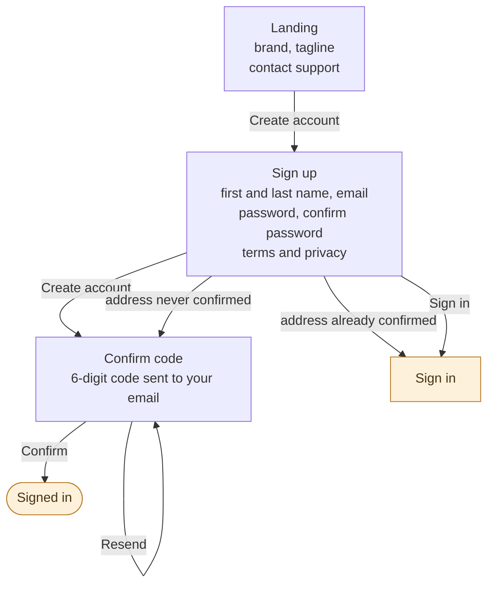

Confirming the code signs the caregiver in without asking for the password a second time, so signing
up ends in the same place signing in does — and a caregiver who turns out to already have an account
leaves through the cross-link rather than by going back to Landing.

An address that already has an account is answered by which kind of account it is. A confirmed one
sends the caregiver to Sign in, because signing in is what they were trying to do. One created but
never confirmed sends them to Confirm code with a fresh code, because finishing is what they were
trying to do. Saying only that the address is taken would strand the second kind at the one screen
that cannot help them, which is the trap an abandoned signup already falls into.

**Signed in, no care team.** Where a caregiver lands when their account exists but belongs to nothing
yet — either because they were invited, or because they are the one starting a team.

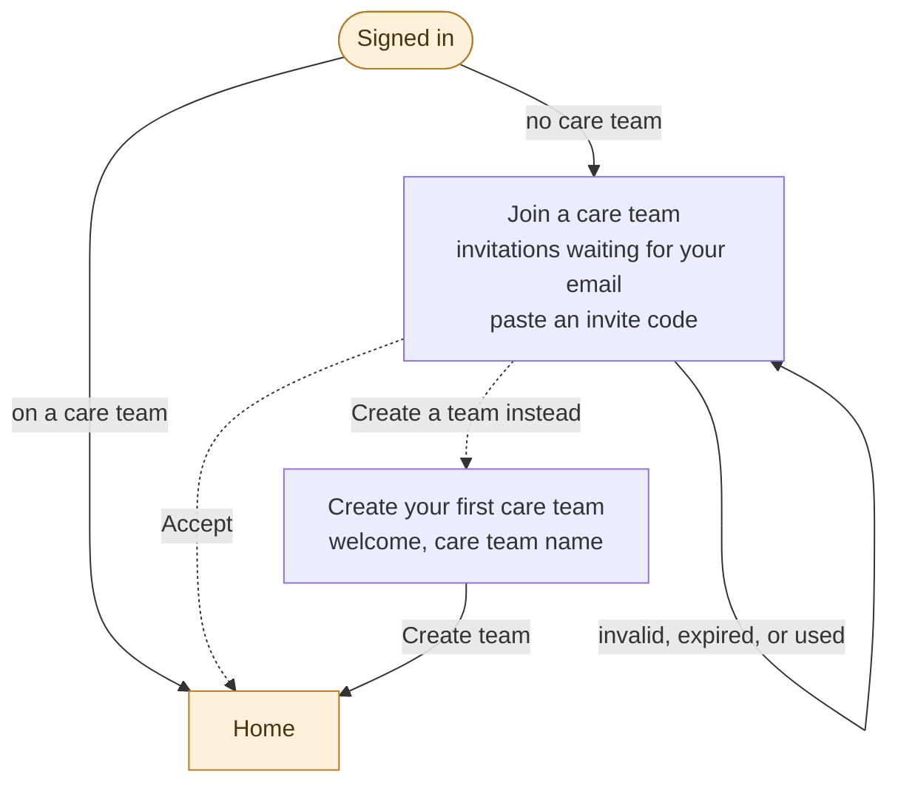

Join a care team is where a caregiver accepts an invitation waiting for their email or pastes an
invite code, with creating a team offered as the alternative rather than the only option. Accepting
an admin-role invitation additionally requires signing in with the address it was sent to.

Two behaviors have no screen of their own. **Remember me** stores the email address only and prefills
it on the next launch. **Face ID** is offered once, in a sheet the first time a caregiver reaches
Home on a device that supports it; from then on the credentials live in the device keychain and the
prompt comes up automatically whenever a session lapses on its own — but never after a deliberate
sign out, which is a caregiver saying they want out.

#### Gaps in this flow

- **Only the happy path through an invitation is drawn.** An invite code can be expired, already
  used, meant for a team the caregiver already belongs to, or an admin invitation opened from the
  wrong address, and each of those needs a place to land. The Team tab takes codes and waiting
  invitations too, so both screens are owed the same answers.

### Home

Home is the landing tab and answers one question — how is this care receiver right now? Everything on
it is scoped to the **active care receiver**, and switching receivers reloads the whole screen.

It is built from what a caregiver needs, in the order they need it: what is wrong, what is coming,
what has already happened, and a way to log. Trackers appear on Home only when they need attention —
a logged value outside its range, a tracker that has gone longer than its gap without being logged,
or care that has gone missed — because a screen that lists every tracker whether or not anything is
happening teaches caregivers to stop reading it. When nothing needs attention, Home says so plainly
rather than leaving an empty space where a warning would be.
The receiver's full set of trackers is always one tap away.

Nothing on Home is dismissed. A range alert stands until a later reading comes back in range, a gap
stands until someone logs the tracker, and missed care stands until a caregiver logs it or skips it,
because what Home shows should be the state of the care rather than the state of someone's
notifications — an alert that can be tapped away is one a busy caregiver will tap away. Skipping is
one of the things that clears something from Home, and a skipped entry never returns to it: Home is
what needs attention and a skip is attention already paid. Skips live in their tracker's list, where
the record of what did and did not happen belongs.

What needs attention is ordered by how much it matters: missed care first, then readings outside
their range, then trackers past their gap — a dose nobody gave outranks a reading that is merely
high, which outranks a tracker that has only gone quiet. Home shows at most three at a time and says
how many there are altogether, because a list that can grow without limit is one a caregiver stops
reading at the top.

When a team keeps a roster, Home also names who is on duty for this receiver right now. It is a
coordination signal and nothing more — it never decides who may log an entry, and a team that keeps
no assignments simply sees nothing there, because coverage is optional and Home should not imply
otherwise.

Home holds the receiver's name with the care team, who is on duty, whatever needs attention, a
coming up banner, the daily timeline, and a link to all of the receiver's trackers. Pulling down
refreshes the whole screen. The paths through it are drawn one at a time below, and each diagram
shows only the part of Home its flow begins from.

**The active care receiver.** Who Home is about, and the trackers that belong to them.

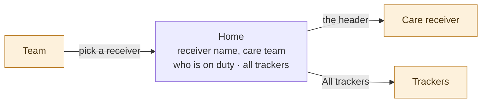

Home has no receiver switcher of its own, and its header does not lead to one. Tapping the header
opens the care receiver — their instructions, who to call, who is meant to be there — because a
caregiver who taps a person's name is asking about that person, and the screen that answers should
not be a tab away from the screen that prompted the question.

Switching receivers belongs to Team, and the tab bar already puts Team one tap from here, so a
header that led there would only have been a second door onto a route that already exists. The care
team named in the header is context rather than a destination for the same reason. Picking a
different receiver on Team reloads the whole screen. Trackers is a handoff into its own area and a
destination here; what it holds is described in its own section.

**Needs attention.** What is wrong right now, and where each kind of trouble leads.

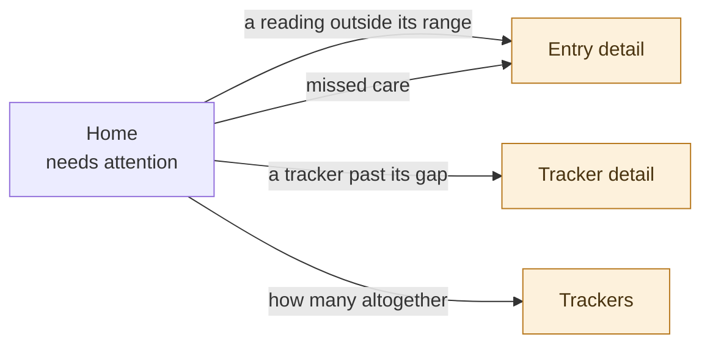

A reading outside its range leads to the entry that carries it, and missed care to the entry that is
waiting — both are a single entry a caregiver can act on, the first to correct or confirm the
reading, the second to log or skip the care. A gap alert has no entry to lead to, because it is
raised by the absence of one, so it leads to the tracker that has gone quiet. An entry reached this
way names the field that fell outside its range and the range it was expected to hold to, since a
caregiver arriving from an alert has to see what the alarm was about before they can decide anything
about it. The count of everything needing attention leads to the Trackers list with its filter
already on, so the three Home has room for are never the only three a caregiver can reach.

**Coming up.** What is due next.

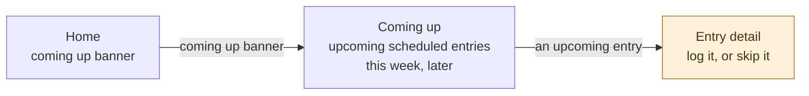

Coming up is a pushed screen. An entry opened from it leads to the entry itself rather than to its
tracker, so what a caregiver is looking at is the thing they can act on. A reminder tapped from
outside the app lands in the same place — the scheduled entry it is about, ready to be logged or
skipped — because someone who has just been told a dose is due should arrive at the dose rather than
at a screen about it.

**The daily timeline.** What has already happened, a day at a time.

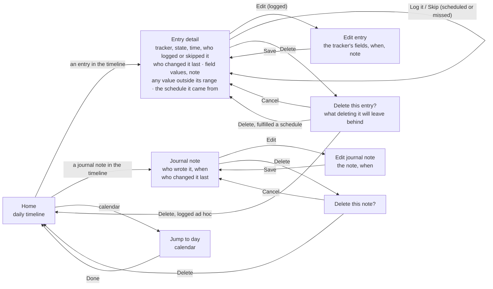

Entry detail is the one screen any entry is read on, whatever state it is in, because an entry that
is scheduled this morning and logged this evening is the same entry and should not change address
when it changes state. What it offers changes with the state rather than with where it was opened
from: a scheduled or missed entry offers Log it and Skip, a logged one offers Edit and Delete, and a
skipped one offers both: editing it logs the care, saying it happened after all, while deleting the
skip leaves the occurrence waiting again for whoever marked the wrong dose.
It names the schedule an entry came from when it came from one, so a caregiver can tell this
evening's dose from a reading somebody took because they felt like it, and it marks any value that
fell outside its range, because an alert now leads here and the screen has to answer for itself why
it was worth interrupting someone.

Editing happens in a sheet over Entry detail rather than on a screen of its own — a caregiver
correcting a digit is not going somewhere, and saving returns them to the entry they were reading
rather than closing it out from under them. Deleting always asks first, and the confirmation says
what deleting will leave behind, because the answer differs: an entry logged ad hoc is simply gone,
while one that fulfilled a scheduled entry leaves that occurrence waiting again. Only the first
leaves the screen; the second stays on it, now reading as missed. An edit that moves an entry to
another day takes the timeline with it: a caregiver who corrects Tuesday to Monday meant Monday, so
the day behind them becomes the one the entry now belongs to rather than the one they happened to
open. The alternative is an entry that appears to vanish at the moment it is corrected. Deleting a
journal note asks the same way, since the two sit side by side in one timeline and confirming only
one of them would read as an oversight.

Jump to day, Edit entry, Edit journal note, and both delete confirmations are sheets; Entry detail
and Journal note are pushed. The day stepper walks a day at a time and stops at today, so the
timeline looks back but never forward. A caregiver who has stepped back returns in one tap: a Today
button sits with the date
whenever the timeline is showing any day but today, because the way out of the past should not cost
as many taps as the way in.

**The tab bar.** Logging, and leaving Home for another tab.

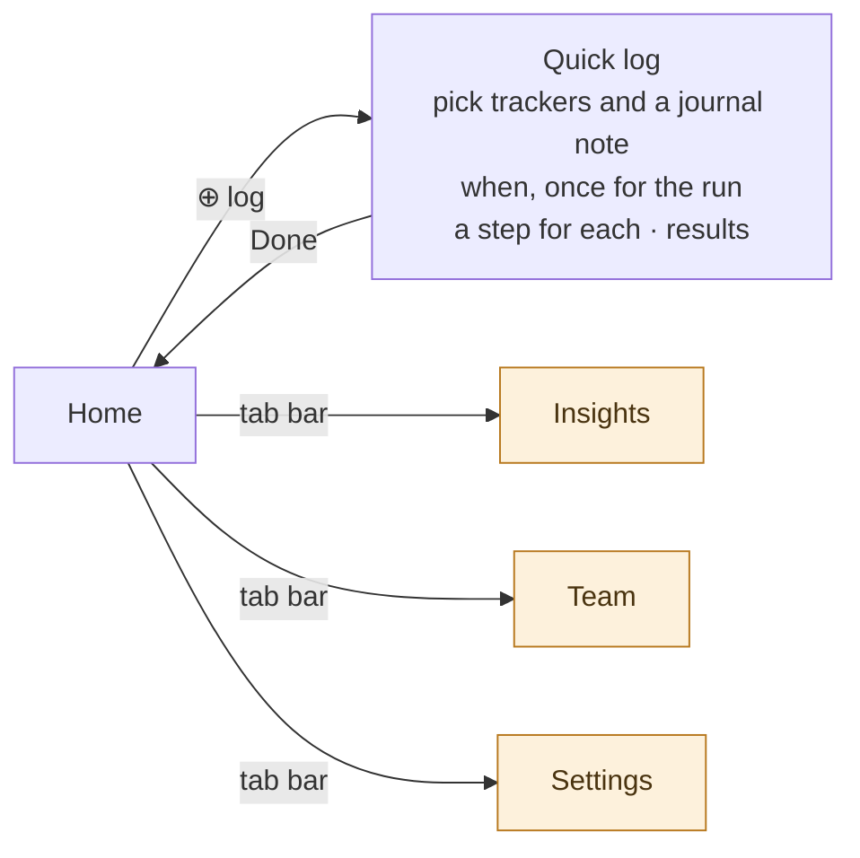

The ⊕ button sits in the tab bar and opens Quick log, one sheet that runs in three parts: what to
record, when it happened, and then a step for each thing picked, ending in a result. Trackers are
picked from the active care receiver's list, several at once, and a journal note is picked from that
same list and written like any other step — so the one button a caregiver reaches for covers
everything that goes into the record.

**When is asked once, for the whole run.** A caregiver writing up the end of a long day is recording
several things that happened at about one time, and asking again on every step would be asking the
same question five times to get the same answer. The choices are now, an earlier time today, or a
future time — and a run given a future time is not logging at all: it creates scheduled entries,
planned rather than recorded, because a caregiver saying the appointment is next Tuesday is saying
that something will happen, not that it has. One time governs the whole run, so a run is either
logging or planning and never both. A caregiver who needs one item at a different time edits it
afterward, which the app already allows for any entry.

**A planned run still walks every step, and pre-fills rather than records.** What can be known in
advance is filled in — the dose, which pills, what the appointment is for — while a reading nobody
has taken yet is left blank for whoever takes it. A tracker schedule already pre-fills the
occurrences it generates, and a plan made by hand should not carry less than one made by a rule. A
planned run also asks once whether the team should be told if the care is missed, since a
missed-care alert belongs to the occurrence it is about and not every plan warrants one.

**Journal notes cannot be planned.** They leave the picker the moment a run is given a future time,
because a note exists to tell the next caregiver what a day was like, and there is nothing yet to say
about a day that has not happened.

The run ends on a result that reports item by item, since some may save while others do not, and a
caregiver who has just entered five things needs to know which of them landed. A logging run returns
to a Home that already reflects the new entries; a planning run returns to a Home where they sit
under what is coming up rather than in the day behind it.

#### Gaps in this flow

- **Nothing here catches an ad-hoc log that lands near a scheduled one.** A caregiver logging a dose
  twenty minutes before it was due is meant to be offered the chance to fulfil it; that offer has no
  screen, so the two records simply coexist.
- **A one-off scheduled entry cannot be changed once it is made.** Quick log creates one — an
  appointment next Tuesday, a dose planned for the evening — but nothing afterward changes its time,
  its pre-filled values, or whether being missed should alert anyone. Entry detail offers a scheduled
  entry Log it and Skip; editing belongs to entries already logged.
- **Emergency contacts do not surface at the moment of trouble.** Home's header now reaches them in
  one tap, but nothing brings them up alongside an alert — the point at which a caregiver is most
  likely to need to call someone, and the one moment they should not have to go looking.
- **A point on a chart does not open its entry.** The timeline, needs attention, Coming up, and a
  tracker's own list all lead to Entry detail, but a reading a caregiver has picked out of an insight
  is an entry they are looking at with no way to open it.
- **Home with no care receiver has no described screen.** Team offers Add care receiver, so the
  first caregiver has somewhere to go; what Home itself shows before any receiver exists, and
  whether it should send them there, decides what their very first look at the app feels like. A
  receiver who exists but has no trackers is answered on the Trackers list.

### Trackers

Everything about the things a team keeps track of: the list of a receiver's trackers, the record one
of them holds, and the controls that change what it collects. Home reaches this area two ways — "All
trackers" from the receiver header, and a gap alert from needs attention, which lands directly on the
tracker that has gone quiet.

**The list.** Every tracker belonging to the active care receiver.

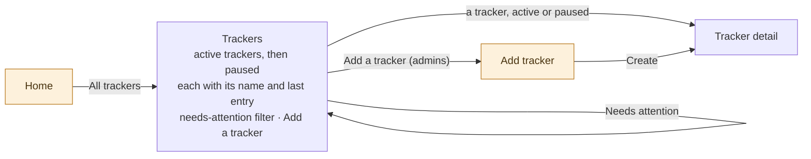

Trackers answers what a team is keeping track of for this person. It is scoped to the active care
receiver like everything else reached from Home, and switching receivers reloads it.

Active trackers come first and paused ones after, in two labelled groups. A paused tracker is still
part of the record and dropping it from the list would leave a team wondering where something went,
but it is not something anyone is being asked to log today, so it does not sit among the things that
are. Within each group trackers are listed alphabetically and stay there: Home is what surfaces
trouble, while this is where a caregiver comes looking for a particular tracker, and a list that
rearranges itself around today's problems is one where the thing they reached for has moved.

Each row carries the tracker's name and how long it has been since anything was logged against it,
and marks the ones where something is wrong — a value out of range, a gap run past, care gone missed.
Home shows only the trackers needing attention and only three of them; this shows all of them, so the
state has to travel with the row or a caregiver would have to open each one to find out. A paused
tracker's row says when it was paused instead, since how long ago it was last logged stopped meaning
anything the moment it stopped being collected.

A filter narrows the list to the trackers that need attention. Home shows at most three of those and
says how many there are altogether; this is where "altogether" leads. With the filter on the paused
group disappears entirely, because a paused tracker's thresholds have stopped and it cannot be one of
the ones in trouble. The filter is off every time the screen is opened, since a list that remembers
being filtered is one where a caregiver decides trackers have gone missing.

Admins add trackers; every caregiver reads the list. Creating one lands on the new tracker rather
than back on the list, because the next thing anyone wants after making a tracker is to see it. A
receiver with no trackers at all is offered the first one instead of an empty screen, since deciding
what to keep track of is what a team does immediately after adding someone to care for.

**Tracker detail.** What one tracker is, and everything logged against it.

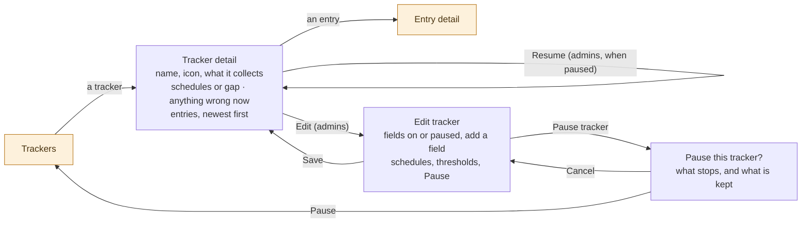

Tracker detail is the only screen that shows a tracker whole. Home's timeline is one day across every
tracker and an insight is one shape drawn from many entries; this is one tracker, all of it, newest
first. The list holds logged, missed, and skipped entries together, because a caregiver checking
whether the evening dose is actually being given needs to see the nights it wasn't — a run of logged
doses tells the truth only when the missed ones sit between them. Entries still to come are not here;
Coming up is what looks ahead. Any entry in the list opens the entry itself. The list begins with the
most recent stretch and keeps loading as a caregiver scrolls rather than claiming to show everything
at once: a tracker logged twice a day for a year holds hundreds of entries and no screen is honest
about that in one go. What matters is that the recent ones, the ones answering whether the care is
happening, are there without being asked for.

Above the entries the screen says what the tracker is and how it is doing: what it collects,
including the fields that have been paused, its schedules or its gap, and whether anything is wrong
right now. This is where a gap alert lands, so it has to answer what the alarm was about — how long
the tracker has gone unlogged, and how long the team said was acceptable.

Every caregiver reads this screen; only admins see Edit, since admins manage the team's trackers
while every caregiver logs against them. Edit tracker and the pause confirmation are sheets; Trackers
and Tracker detail are pushed. The edit sheet is where the rule that a tracker has schedules or a gap
but never both is enforced, and an admin turning on one is told what they are about to lose. **Pause
sits inside the edit sheet rather than on the screen itself**, because it is the last thing a team
does to a tracker rather than something that should be within reach while reading one. The
confirmation says what stops and what is kept, since a caregiver who reads "pause" as "delete" would
never press it.

A paused tracker opens the same screen, reading as paused. It keeps everything worth reading — what
it collected, what the team expected of it, and every entry ever logged against it — and offers no
way to add another, because having stopped collecting is what being paused means. In place of the
logging stand two things. **Resume** says what will start again before an admin presses it: the
schedule that will begin generating, the thresholds that will begin raising alerts. **Edit** stays
where it was, because a tracker is often paused precisely because something about it was wrong, and
an admin made to resume one before they can correct its threshold gets the alerts they paused it to
stop. Resume does not ask twice. Pausing asks because a caregiver may read it as deleting
and the confirmation is there to promise that nothing is lost; resuming promises nothing and only
puts a tracker back the way it was, and a question whose answer is always yes teaches people to stop
reading questions.

#### Gaps in this flow

- **What Add a tracker opens is undescribed.** The Trackers list offers it and creating one lands on
  the new tracker, but nothing says what the screen in between holds, or how a tracker template
  becomes a tracker.
- **A tracker's insights are not reachable from it.** A caregiver reading a tracker's entries has no
  way to the chart drawn from those same entries; Insights is its own tab, reached from the tab bar
  and nowhere else.

### Team

Team answers who is involved in this care: which care teams a caregiver belongs to, which care
receivers each one looks after, and who else is helping look after them. It is scoped to the
caregiver rather than to a care receiver — switching receivers reloads Home and Trackers and leaves
Team exactly as it was, because Team is the screen a receiver is switched on.

There is no active care team. A care receiver belongs to exactly one team, so choosing a receiver
already chooses a team, and a second thing to be "in" would only be a second thing to get wrong — a
caregiver reading Michele's Home while the app believes them to be in another family is a state
nothing on screen could explain. Home names the receiver and their team together in its header,
where the team is simply the one that receiver belongs to.

Switching happens only here. A sheet on Home that changes the receiver and a tab that changes the
receiver are two doors onto one decision, and when only one of them can also say what a care team is
— who else is on it, who is being cared for, what is waiting to be accepted — that is the one that
should stay. The cost is honest and small: switching receivers takes a trip to another tab rather
than a pull on the header, and a caregiver who switches often is a caregiver on more than one team,
which is exactly who needs the rest of this screen. Home's header leads to the care receiver rather
than here, because tapping a person's name asks about that person and the tab bar is already the way
to their team.

Reading the roster is not an admin privilege. Every caregiver sees who else is on their team and what
role each of them holds, because deciding whether to hand a problem to someone means knowing who is
there — and a team where only admins can see who the team is coordinates by asking.

A care team always has an admin. Nothing anyone does may leave one without: the last admin cannot
demote themselves, cannot leave, and cannot close their account, and each attempt is refused with the
same answer — promote someone first. A team with no admin can never invite a caregiver, add a
receiver, or make a tracker again, and nothing inside the app can undo it.

Leaving takes away the access, not the record. A caregiver who leaves a team, or is removed from one,
keeps nothing and loses nothing: every entry and journal note they wrote stays where it is, under
their name, exactly as it does when a caregiver closes their account.

**The teams you belong to.** Every care team, its care receivers, and the way into a new one.

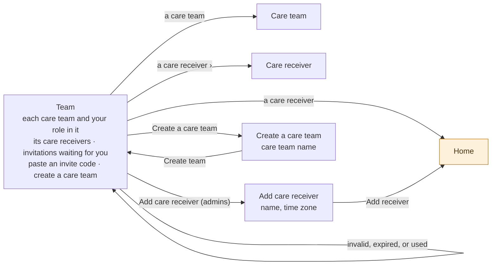

Picking a receiver makes them the active one and lands on their Home, because picking one is a
caregiver saying that is who they want to look at. Adding one does the same for the same reason — and
a new receiver with no trackers is met by the Trackers list offering the first, which is where that
story already continues. Creating a care team stays on Team instead: a team made a moment ago has no
receivers and no caregivers but the one who made it, so there is nothing to land on yet, and the row
it becomes is the thing to act on next.

Invitations waiting for a caregiver's address appear here whatever teams they already belong to, and
an invite code is pasted here rather than only at the door. Being invited to a second team is the
ordinary case for anyone who helps two families, and an app that offers an invitation only to people
with nowhere to be tells the second family to work it out themselves.

**One care team.** Who is on it, who has been asked, and what it tells you about.

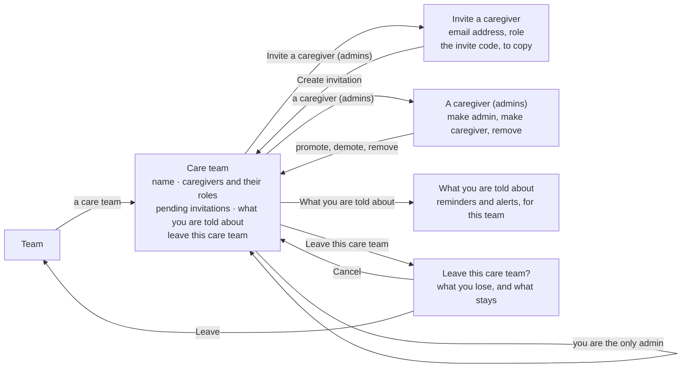

Creating an invitation ends on the team rather than anywhere new, because the invitation is now a row
in the pending list with its code beside it, and copying that code is the next thing the admin does.
The code stays copyable for as long as the invitation goes unused, so an admin who sent it to the
wrong place can send it again without asking anyone to start over.

The actions on a caregiver sit on that caregiver's row, since every one of them is about a particular
person and a screen-level Manage button would make an admin say who twice. A caregiver acting on
their own row is offered leaving and nothing else — the roster is the team's business and your own
membership is yours. What the last admin is refused, they are refused here, with the reason rather
than a greyed-out row, because a control that is simply dead teaches nothing.

**What you are told about** is where this team's reminders and alerts are chosen. Settings holds the
channels — push, email, or neither, once for the account — and this holds the subject matter, team by
team, because how someone wants to be reached does not change from one family to the next and how
involved they are does.

**One care receiver.** Everything about the person that is not an entry.

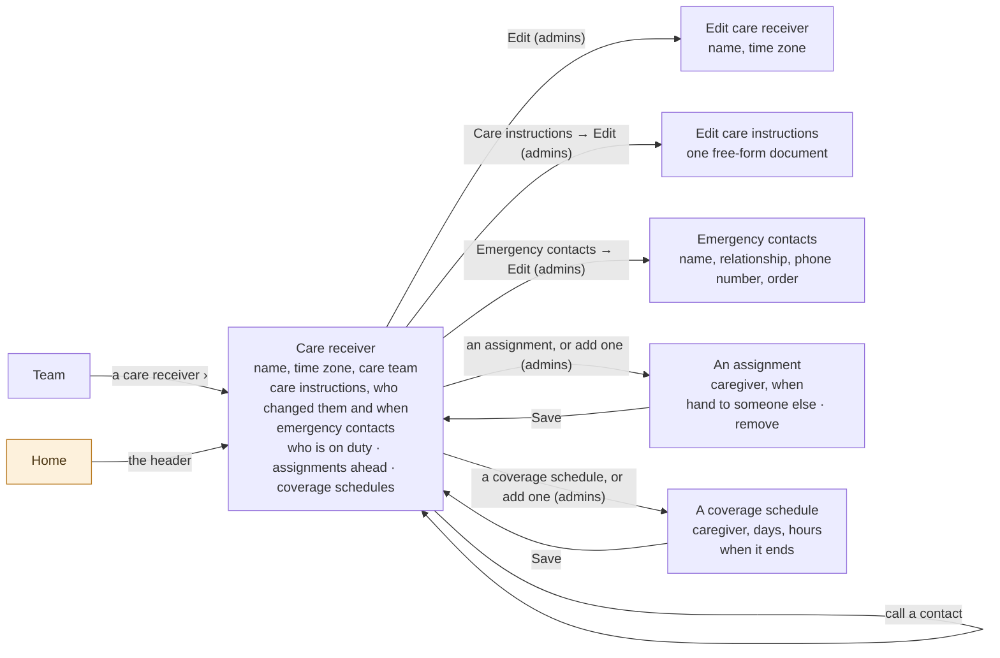

Care receiver is reached two ways — the chevron on a receiver's row here, and Home's header, which
is where a caregiver already is when they need it. It is where the standing knowledge about a person
lives, and it is one screen rather than three because a caregiver who needs it needs all of it: what
the instructions say, who to call, and who is meant to be there. The instructions carry who last
changed them and when right on the screen, so a caregiver reading at 2am can tell standing orders
from something written a year ago. Emergency contacts are rows with a phone number that dials, not a
paragraph to read a number out of. Every caregiver reads all of it; only admins change any of it.

Coverage sits here rather than on a screen of its own. A roster is a short thing — a handful of
assignments and the one or two rules behind them — and the caregiver who opens a receiver to find
out who is meant to be there is the same one who wanted to know how to look after them. Splitting
the two would cost a tap and buy nothing.

Both kinds are made here, in two labelled groups: a one-off **assignment** for the Thursday somebody
is covering, and a **coverage schedule** for the Tuesday somebody always has. They stay apart
because a rotation and a favour are different things — covering one Tuesday for someone should not
rewrite the routine — so opening a single assignment offers handing it to another caregiver or
removing it, and leaves the rule that generated it exactly as it was.

Care team and Care receiver are pushed screens, as is What you are told about. Add care receiver,
Create a care team, Invite a caregiver, the caregiver actions, Edit care receiver, Edit care
instructions, Emergency contacts, an assignment, a coverage schedule, and the leave confirmation are
all sheets. Two things stay put rather than navigating: calling a contact hands off to the phone,
and accepting an invitation turns that row into a care team on the list already in front of the
caregiver.

#### Gaps in this flow

- **Nothing describes a care team ending.** A caregiver can leave, and the last admin is stopped from
  leaving — but the last _caregiver_ of a team is by definition its last admin, and refusing them
  leaves a team nobody can join, empty of people and holding a receiver's whole record with no way to
  reach it. Whether a team can be deleted, what becomes of its receivers and their entries, and
  whether anyone but its members should be able to do it are all unanswered.
- **A pending invitation can be copied but not withdrawn or changed.** An admin who invited the wrong
  address, or invited someone as a caregiver when they meant admin, has no way to cancel the
  invitation or amend it, and the two-week expiry is the only thing that ends it.
- **Ending a coverage schedule early is unanswered.** A schedule is created, changed, and given an
  end date on the care receiver, but nothing says what becomes of the assignments it has already
  generated when a team stops it before that date — whether the ones still ahead disappear with the
  rule, or stand on their own as assignments somebody is still expected to keep.
- **Nothing shows the time nobody is covering.** Assignments exist so that uncovered time is
  something a team can see rather than discover afterward, but the care receiver lists the
  assignments that exist rather than the hours that have none. No screen answers "is Thursday
  covered?" for a Thursday nobody has filled.
- **What a former teammate looks like on the roster is undescribed.** Entries keep the name of a
  caregiver who left, the way they keep the name of one who closed their account, but nothing says
  whether the team can still see who that was, or whether they read as a former caregiver here too.

### Settings

The only area of the app that is not about a care receiver. Home and Trackers reload when the active
receiver changes; Settings does not change at all, because it holds the caregiver's own account, how
they want to be reached, and the app itself. Nothing logged, nothing tracked, nobody else's.

It holds nothing about a care team either. Which teams a caregiver belongs to, who is on them,
whatever they might do to one, and which reminders and alerts they want from each all live on the
Team tab — for the same reason the notification split falls where it does. Settings is about the
person, and a care team is not a property of a person; it is a thing several people share.

**Your account and this device.** Who you are to the app, and how you get in and out of it.

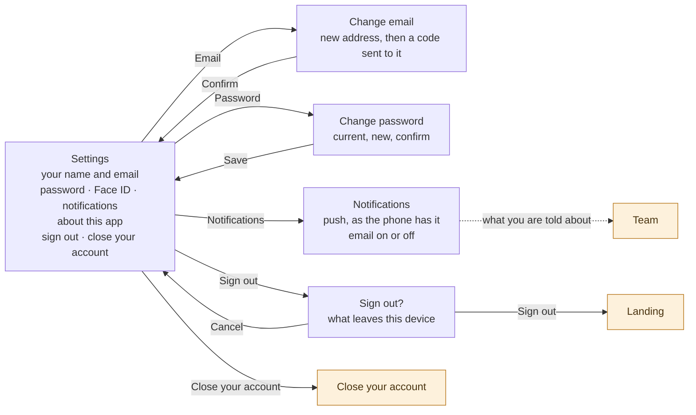

Change email and Change password are sheets; Notifications is a pushed screen. Changing an address
sends a code to the new one and is not finished until that code is entered, because an address nobody
can prove they hold is a way to lose an account rather than a way to reach someone.

**Face ID** is a switch here rather than a one-time offer. The sheet that appears the first time a
caregiver reaches Home is only the first time it is asked; afterwards this is where it is turned on
and off, so a caregiver who declined it once is not locked out of it forever.

**Signing out** asks first, and says what it takes with it. Face ID switches off and the saved
password leaves the device; the remembered email stays and prefills the next sign in. A device two
caregivers share must not hand the second one the first one's account, and the email alone unlocks
nothing — it saves the person coming back a typing job and costs the person leaving nothing. This is
also what makes the promise elsewhere true: Face ID never prompts after a deliberate sign out,
because after a deliberate sign out there is nothing left on the device for it to unlock.

**Notifications** here are the channels only — whether the app reaches a caregiver by push, by email,
or neither. Push is shown as the phone has it rather than as a switch the app owns, with a way out to
the system settings when it is off, so a caregiver wondering why nothing arrives is told the true
reason. Which reminders and which alerts a caregiver wants from a particular care team is set with
that team, not here, because involvement differs from team to team while the way someone likes to be
reached does not.

**Closing an account.** The way out, and what it leaves behind.

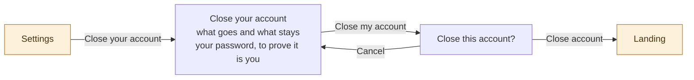

Closing an account is a pushed screen rather than a row that opens a dialog, because it has something
to say before it asks anything: the account goes, and the care stays. Every entry and journal note
the caregiver wrote remains where it is, attributed to a former caregiver. The screen says so plainly
rather than leaving people to guess, since a caregiver who fears they are about to delete a year of
their mother's readings will simply never press it — and one who assumes the opposite deserves to
know before rather than after. It asks for the password, because an account left open on a borrowed
phone should not be closable by whoever picks it up.

An account cannot be closed while it is a care team's only admin. The screen names the team and asks
for someone else to be promoted first, on the same reasoning that stops that caregiver leaving: a
team nobody can manage is one no caregiver can be added to, and closing an account is not a way to
put a family in it.

#### Gaps in this flow

- **Changing an email address can strand a pending invitation.** An admin-role invitation must be
  accepted from the address it was sent to, so a caregiver who changes their address while one is
  waiting has an invitation they can no longer accept and no way to say so.

## Open questions

1. **How late is missed?** A dose given at 8:05 should not be reported as missed care, so a grace
   period has to pass before a scheduled entry counts as missed and any missed-care alert fires. The
   likely shape is a configurable grace period defaulting to one hour after the scheduled time. What
   remains open is what it is configured on — the schedule, the tracker, or the care team — and
   whether the same period governs both the missed state and the alert.

2. **Should coverage route notifications?** Today reminders and alerts reach the whole team
   regardless of who is assigned, and a roster is purely informational. A roster that decided who
   got notified — reminding whoever is on duty, alerting them first when care is missed — would cut
   notification fatigue and give the roster a reason to stay accurate, since a stale one would be
   felt immediately. What holds this back is the edge cases rather than the idea: which
   notifications should route at all (a dose coming due is a task and belongs to whoever is on duty,
   while a reading outside its threshold is information the whole team wants either way), who hears
   about it during hours nobody is assigned, and how a caregiver stays informed about a receiver
   they are not on duty for.

3. **What clears an alert its entry no longer supports?** Home says an alert stands until the care
   changes — a range alert until a later reading comes back in range, a gap until someone logs the
   tracker — which is right when the record is right, but says nothing about the record itself
   changing underneath. A caregiver who mistypes 240/160, sees the alarm, and deletes the reading
   has removed the only evidence for an alert that by the stated rule keeps standing, and correcting
   the value rather than deleting it lands in the same place. This is no longer a corner: a range
   alert leads to the entry that raised it, so the reading and the two buttons that change it are
   the first thing a caregiver sees after tapping the alarm. The likely shape is that an alert is
   re-evaluated whenever the entries beneath it change, so one whose only supporting reading is
   corrected or deleted clears on its own. What remains open is how far that reaches — a gap alert
   depends on the absence of entries and a missed-care alert on an occurrence rather than a value,
   and both can be resurrected by a deletion as easily as dismissed by one — and whether a cleared
   alert should leave any trace. A team that saw an alarming reading in the morning and by evening
   finds neither the alert nor the reading has been told nothing about what happened, which is its
   own kind of wrong.

4. **Does an entry stay with its occurrence when its time is edited to another day?** Logging a
   scheduled entry attaches a record to a plan, and the PRD already holds that the plan does not
   move: a caregiver logs the occurrence with the time the care actually occurred rather than
   bending the schedule to match. Editing afterward tests how far that stretches. Correcting last
   night's dose from 8pm to 9pm is plainly the same care; dragging it to the following afternoon is
   plainly not, and somewhere between the two the record stops describing the occurrence it is
   attached to. The likely shape is that the entry stays attached however its time is edited,
   because the caregiver said this is the care that occurrence was for and no later edit unsays it.
   What remains open is whether there is a distance at which the app should stop believing that,
   whether a caregiver should be able to detach an entry deliberately — leaving the occurrence
   missed again and the entry standing on its own — and what Monday's timeline and Monday's insights
   should make of an occurrence fulfilled by an entry timed for Tuesday.
