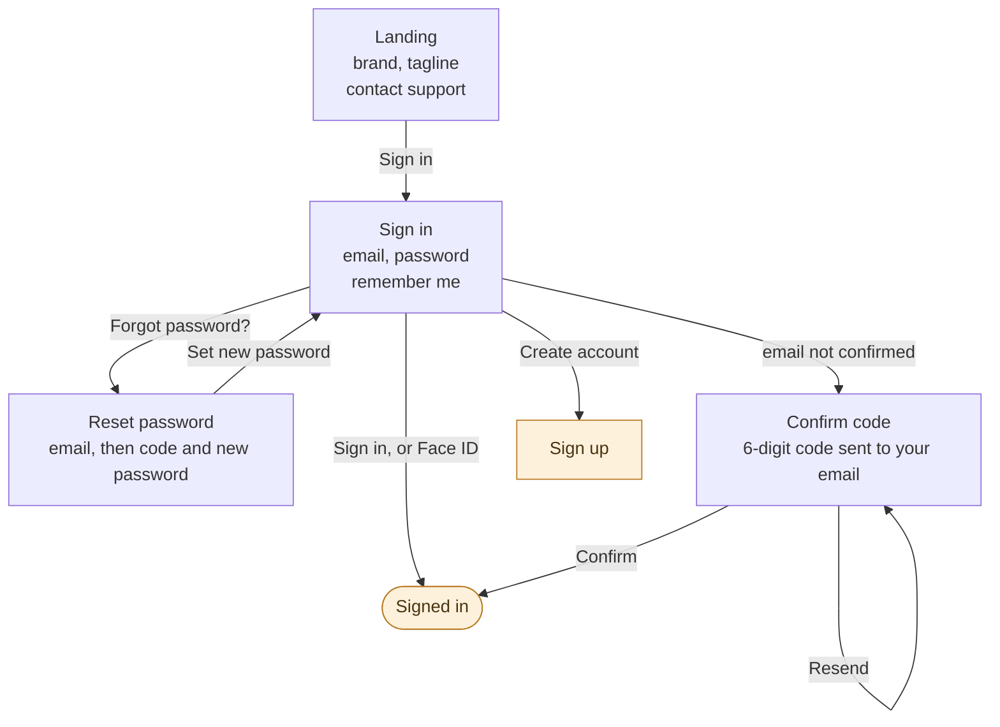
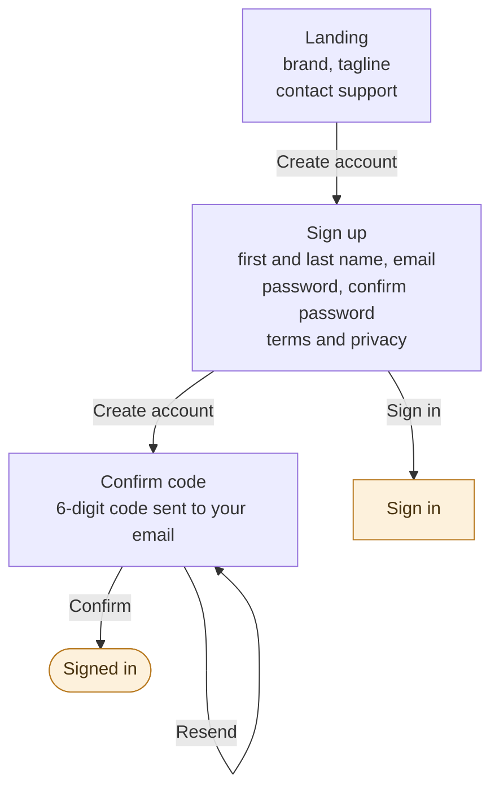
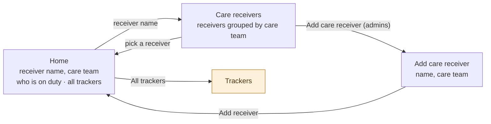
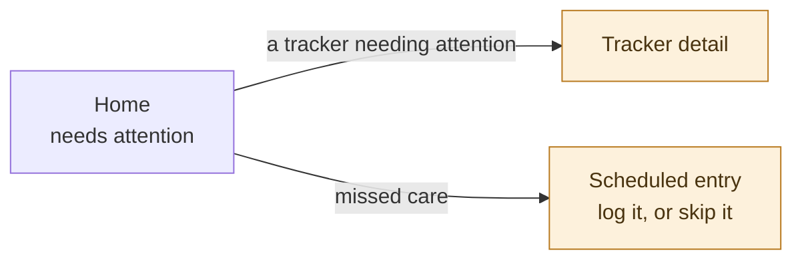
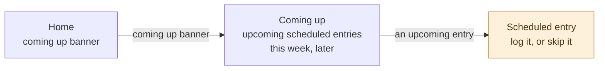
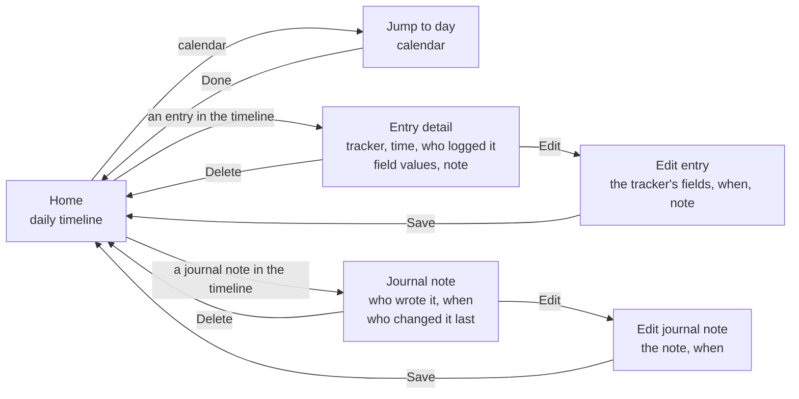
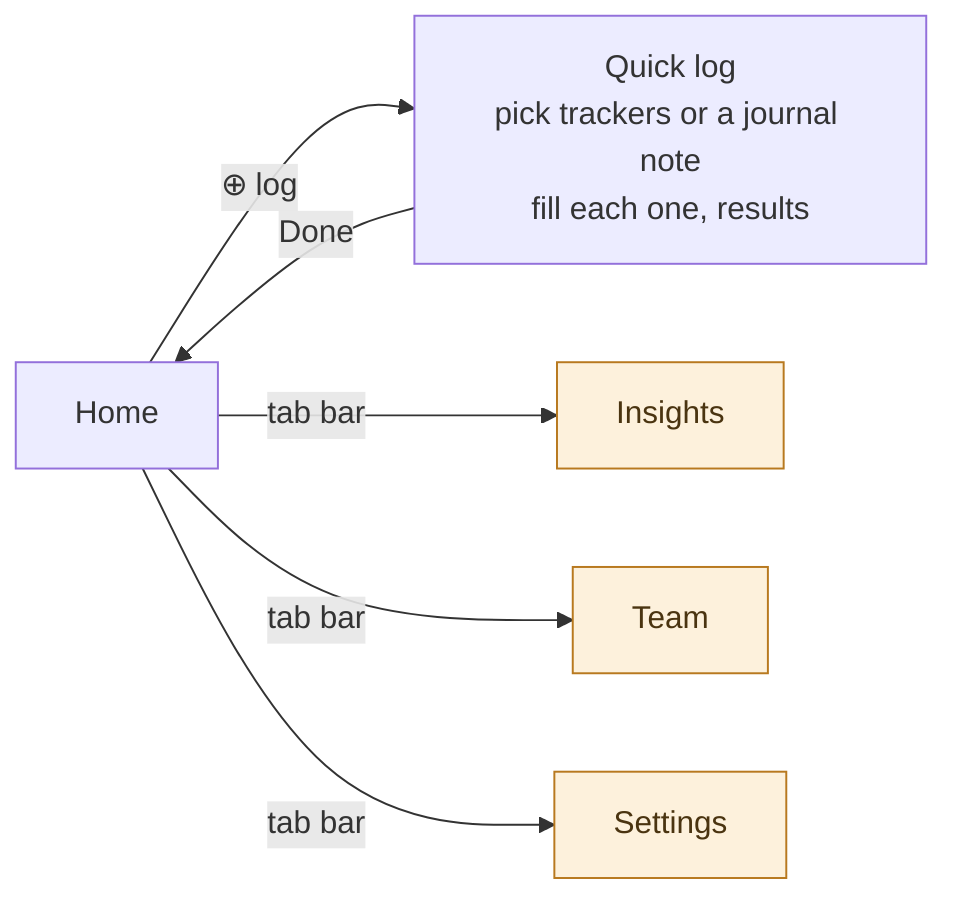

# Product Requirements

## About this document

This document is the authority on what the product is. When it and the built app disagree, the
document is right and the app is what changes: it describes the target state rather than the current
implementation, and much of it is deliberately ahead of what exists. Decisions about scope,
behavior, and vocabulary are settled here first, and anything built is expected to answer to it.

It stays high level on purpose. It covers the problem being solved, the goals, the shared vocabulary
the team uses to talk about the domain, and the experiences a caregiver moves through — never files,
functions, endpoints, or the internals of any client. Those live in the repository, change far
faster than the product does, and would make this document wrong within a week of being written.

What is unresolved is recorded rather than hidden. Each flow ends with the gaps in it, so a path
nobody has thought through is visible instead of being discovered mid-build, and the open questions
at the end hold the decisions still to be made.

## Problem Statement

When someone requires care, multiple caregivers often share responsibility and need to coordinate.
Each caregiver needs a way to log the care they provide and stay informed about what others are
doing, but every care receiver is different. Therefore, caregivers only want to track what's relevant
to that person. Today, caregivers have no easy way to visualize or make sense of the care being given
over time, or to connect it to what's happening in the care receiver's life.

## Goals

- Caregivers have a central place to organize and track the care they give to shared care receivers
- Caregivers gain insight into the care receiver's life through trends and charts
- Caregivers receive reminders about upcoming care and alerts when logged values fall outside their
  expected range
- Caregivers feel confident they're not duplicating effort or missing important care, even when
  multiple people are involved

## Definitions

**Caregiver** — A person who helps care for a care receiver and logs entries about that care. Every
member of a care team is a caregiver; a caregiver can belong to more than one care team.

**Care receiver** — A person who is being cared for, and about whom entries are logged. Each care
receiver has a time zone, and every wall-clock rule about them is expressed in it: when a schedule
fires, when a scheduled entry is due, when it becomes missed, and where one day ends and the next
begins. Caregivers always see a receiver's times in that zone, whatever zone they are themselves in,
so everyone on a team calls the evening dose by the same name. If a receiver's time zone changes —
they move, or spend the winter somewhere warmer — their routines keep their wall-clock times and
shift with them, because an 8:00am dose is a dose taken after waking up, not a dose taken at a
particular instant.

**Care team** — A shared space containing one or more care receivers and the caregivers who look
after them. Every care receiver, tracker, and entry belongs to exactly one care team.

**Admin** — A role held by one or more caregivers on a care team. Admins invite and remove
caregivers, promote other caregivers to admin, and manage the team's care receivers, trackers, care
instructions, and coverage. The caregiver who creates a care team is its first admin. Every
caregiver logs entries; admins additionally manage the team's setup.

**Invitation** — How a caregiver joins a care team. An admin creates an invitation for a particular
email address and role, then shares it with that person however they already talk to them; the app
does not send email on their behalf.

There are two ways to redeem one, and the common one asks nothing of the invitee. A caregiver who
signs up with the address they were invited at finds the invitation waiting in the app and accepts
it — no code, no link, nothing to carry between two apps. For when that address will not work —
someone uses Apple's Hide My Email, or signs up with a different address than the admin had on hand
— every invitation also carries an **invite code** the admin copies and sends, and the invitee
pastes into the app, so a wrong guess at someone's email is a small annoyance rather than a dead
end. The code is long and random rather than short enough to read aloud, because it is always
copied: nobody should be able to reach a care team by guessing. An admin can copy it again from the
team's pending invitations for as long as it goes unused. **Admin-role invitations are the
exception: they must be accepted from the invited address**, because promoting someone to admin
should not be possible by passing a code along. An invitation is single-use and expires after two
weeks, so a code shared once does not stay live.

**Assignment** — A span of time during which a named caregiver is responsible for a care receiver.
Assignments are how a care team answers "who has Thursday?": they make coverage visible so two
caregivers don't both drive over, and so time nobody is covering is something the team can see
rather than discover afterward. An assignment is a coordination signal, not a permission boundary —
every caregiver can log entries for any receiver on their team at any time, whether or not they are
assigned, and nothing about reminders or alerts depends on who is on duty. Assignments can overlap,
since a family member and a paid aide are often present together, and time nobody is assigned to is
simply uncovered. An assignment covers a care receiver as a whole, not particular trackers.

Coverage is optional. Many teams coordinate informally and never need a roster; a team that keeps
none simply has no assignments, and nothing else in the app changes. Admins manage the roster —
creating, changing, and reassigning a team's assignments and coverage schedules.

**Coverage schedule** — A recurring rule that generates assignments, such as "Trevor, every Tuesday
8am–4pm". A care receiver can have any number of coverage schedules, which is what lets a team
describe a real rotation. A schedule can end on a set date, so a temporary arrangement stops on its
own. A single generated assignment can be handed to another caregiver without touching the rule
behind it, so covering one Tuesday for someone does not rewrite the routine.

**Care instructions** — A written description of how to care for one care receiver, kept by the
team's admins and readable by every caregiver. It holds the standing knowledge no tracker can: that
the morning pills go down with food, that the walker comes along for anything past the kitchen, that
the hearing aid goes in before anyone tries to talk. A care receiver has one set of instructions, and
they belong to the receiver rather than the team, because two receivers on the same team are cared
for differently.

The instructions are a single free-form document an admin writes in their own words — no list, no
categories, no fields — because care is described in sentences, and an app that asks which category
something belongs to is an app where somebody stops writing. The document records who last changed
it and when, so a caregiver reading it at 2am can tell standing orders from something written a year
ago and never revisited.

Beside the document is a list of **emergency contacts**: each a name, a relationship, and a phone
number, held as real fields rather than typed into the prose, so a caregiver can call straight from
the screen instead of picking a number out of a paragraph while something is going wrong. A receiver
can have any number of them, in the order the admin sets, or none.

Admins write both; every caregiver reads them. Care instructions are reference, not activity —
nothing is logged against them, and they never appear in a timeline or an insight.

**Tracker** — Something a care team wants to keep track of about one care receiver — blood pressure,
meals, mood, medication given. A tracker has a name, icon, and color, and defines the fields captured
each time it is logged. A tracker belongs to a single care receiver, so two receivers on the same
team can be tracked differently.

**Field** — One piece of data a tracker captures, such as "Systolic" (a number, in mmHg) or "Mood" (a
choice from a list). A field holds a number, free text, a yes/no, a choice from a fixed list, or a
date and time, and is either required or optional. A tracker has zero or more fields; a tracker with
no fields records only that the thing happened. Field type decides which insights are available:
numbers plot as values over time, while choices and yes/no plot as frequency.

**Threshold** — An optional expectation on a tracker, in one of two forms. A **range** on a numeric
field — an expected low and high, such as 90/60 to 140/90 for blood pressure — raises an alert when a
logged value falls outside it. A **gap** on the tracker as a whole — the longest the team is willing
to go without logging it, such as three days for a shower — raises an alert when that long passes
with no entry at all.

The two forms catch opposite failures: a range notices care that happened and went wrong, a gap
notices care that never happened. A gap is the only expectation available to a tracker with no
fields, which records nothing but that the thing occurred, and it is how a team watches care that
should happen regularly without pinning it to a clock. A tracker that has never been logged counts
from the day it was created, so a gap starts watching immediately rather than waiting for a first
entry.

A tracker has schedules or a gap, never both. Care a schedule already plans is watched by missed-care
alerts, and one lapse should never be reported by two mechanisms — so choosing one means giving up
the other, and an admin changing either is told what they are about to lose.

**Tracker template** — A pre-built tracker definition — name, icon, color, fields, and thresholds —
that a caregiver can add in one step instead of building a tracker from scratch.

**Entry** — A record attached to a tracker: its field values, an optional note, and a time. Every
entry is in one of four states:

- **Scheduled** — planned for a future time, not yet logged.
- **Logged** — a caregiver logged it, so it carries the time it occurred and who logged it.
- **Missed** — its scheduled time has passed and no caregiver has logged it yet.
- **Skipped** — a caregiver deliberately marked it as not happening, whether or not its time has
  already passed. A skip is a decision, not a care failure, so it never counts as missed.

A caregiver logging an entry is what moves it to logged; the passage of time alone never does, so the
app never records care that nobody gave. Missed is not a final state: care often happens without
being logged right away, so a caregiver can log a missed entry at any point afterward and set the
time the care actually occurred — someone catching up on the week during the weekend should not have
to record it as never having happened. A missed entry can equally be skipped, and skipping settles
it: the entry becomes skipped rather than carrying both states, because a caregiver saying the care
was not needed is making a decision whatever hour they make it in. Entries are the raw material for
every insight in the app, and — with journal notes alongside them — for every timeline.

**Scheduled entry** — An entry planned for a future time, such as an upcoming appointment or a dose
due this evening. Scheduled entries are what the app looks ahead to and reminds caregivers about.
They can be created one at a time or generated by a tracker schedule. A scheduled entry becomes
logged only when a caregiver deliberately logs it — either by opening it directly, or by accepting
the app's offer to fulfill it when an ad-hoc log lands near one. The app never attaches a log to a
scheduled entry on its own, so this morning's dose can never be mistaken for yesterday's. A scheduled
entry's time comes from its schedule and is not moved on its own — a schedule that bends occurrence
by occurrence stops describing the routine it exists to describe. If the care happens at a different
time, the caregiver logs the occurrence with the time it actually occurred; if it will not happen at
all, they skip it.

**Tracker schedule** — A recurring rule on a tracker, together with the field values it pre-fills,
that generates scheduled entries. A tracker can have any number of schedules, which is what lets one
tracker describe a real regimen: a morning dose and a different evening dose, or one set of
medications on Monday, Wednesday, and Friday and a different set on Tuesday and Thursday. A schedule
can optionally end on a set date, so a course of treatment stops on its own. Each schedule has a
label a caregiver may type; left blank, it defaults to one derived from the schedule itself, such as
"Med A — MWF, 8:00am". A tracker does not need a schedule at all; entries can always be logged ad
hoc.

**Journal note** — Something a caregiver wants to say about a care receiver's day that no tracker
captures: that the morning was rough and breakfast went half eaten, that a granddaughter visited and
the mood lifted for the rest of the afternoon, that the new pills seem to make the evenings foggy. A
journal note is free-form prose with a time and an author, and any number of them can be written
about one day by any number of caregivers.

Journal notes exist because care worth knowing about is not always care that can be counted. Turning
something into a tracker means deciding in advance which parts of it matter enough to become fields,
and an app where every observation has to clear that bar first is an app where most observations are
never written down at all.

They sit in the daily timeline in time order among the entries logged that day, because the reason
to write one is that the next caregiver reads it. A note carries the time it is about rather than
the time it was typed, so a caregiver writing up Tuesday on Wednesday morning puts it where it
belongs. Writing one notifies nobody: reminders and alerts are both about the clock — care that is
coming, care that went wrong — and a journal note is neither. It is found by reading the day rather
than by interrupting anyone, because a note that reached five phones the moment it was typed is a
note people would think twice about writing.

Every caregiver writes journal notes, and any caregiver can edit or delete any of them, the same as
entries — a family that shares the care of one person shares the record of it too. A note records
who wrote it and, if it has since been changed, who changed it last and when, so a caregiver reading
words with someone's name against them can tell whether they are still that person's words. Journal
notes are not entries: they attach to no tracker, have none of an entry's four states, and are never
plotted — free text has no shape an insight could take, and a day with three notes in it was not a
day with more care in it.

**Reminder** — A notification that a scheduled entry is coming up.

**Alert** — A notification that something needs attention: a logged value fell outside its range, a
tracker went longer than its gap without an entry, or scheduled care was missed. Missed-care alerts
are optional and set on the schedule or one-off scheduled entry they apply to, since not all care
warrants one — a missed dose matters, a missed walk may not. Reminders look ahead; alerts look
back.

**Insight** — Any visualization of a tracker's entries. A chart of blood-pressure readings over time
is an insight; so is a trend line, or a count of how often something happened. Insights are derived
from logged entries only — scheduled entries are excluded until a caregiver logs them, so nothing
planned is ever plotted as though it happened. Journal notes are not plotted at all: they hold prose
rather than values, and there is nothing in them to chart.

## UX flows

These describe the paths a caregiver takes through the app, screen by screen. Each area gets its own
subsection.

### Getting into the app

Everything before Home: creating an account, signing back in, and landing somewhere once the app
knows who you are. One diagram per flow — each box is one screen and lists what it contains, each
arrow is the action that leaves it. Shaded boxes are handoffs — screens that belong to another
diagram, where the flow carries on — and **Signed in** is the point these three share.

Reaching Signed in is not quite the end: the app settles the caregiver's identity and care teams
there, and that is what decides where they land. The same resolution runs at launch, so a returning
caregiver whose session is still good goes straight to Home without passing through Landing at all.

**Signing in.** A returning caregiver, and everything they can reach without abandoning the attempt.

Landing is a pure entry point: once past it, a caregiver crosses between Sign in and Sign up directly
rather than going back. Confirm code and Reset password are sheets over the screen that raised them,
so the form underneath is never lost — and Reset password changes in place rather than navigating,
taking an email and then swapping to a code and a new password, ending back at Sign in rather than
signing the caregiver in on its own.

**Signing up.** A new caregiver, from the entry screen to an account that exists and is confirmed.

Confirming the code signs the caregiver in without asking for the password a second time, so signing
up ends in the same place signing in does — and a caregiver who turns out to already have an account
leaves through the cross-link rather than by going back to Landing.

**Signed in, no care team.** Where a caregiver lands when their account exists but belongs to nothing
yet — either because they were invited, or because they are the one starting a team.

Join a care team is where a caregiver accepts an invitation waiting for their email or pastes an
invite code, with creating a team offered as the alternative rather than the only option. Accepting
an admin-role invitation additionally requires signing in with the address it was sent to.

Two behaviors have no screen of their own. **Remember me** stores the email address only and prefills
it on the next launch. **Face ID** is offered once, in a sheet the first time a caregiver reaches
Home on a device that supports it; from then on the credentials live in the device keychain and the
prompt comes up automatically whenever a session lapses on its own — but never after a deliberate
sign out, which is a caregiver saying they want out.

#### Gaps in this flow

- **Signing out has no flow.** Where a caregiver signs out from, whether it is confirmed, and what
  survives it are unanswered — and on a device two caregivers share, whether the saved email, the
  saved password, and Face ID survive a sign out decides whether the next person is handed the
  previous caregiver's account.
- **There is no way to leave.** Nothing here says how a caregiver deletes their account, or how they
  change a password or email address once they have one. An app that lets people create accounts has
  to let them close them.
- **Face ID is described in one direction only.** It is offered once and then used; turning it back
  off, and what happens to it when a different caregiver signs in on the same device, are unstated.
- **Signing up with an address that already has an account is undefined.** The address may belong to
  a finished account or to one abandoned before its code was entered, and those deserve different
  answers — one is "sign in instead", the other is "here is your code again".
- **Only the happy path through an invitation is drawn.** An invite code can be expired, already
  used, meant for a team the caregiver already belongs to, or an admin invitation opened from the
  wrong address, and each of those needs a place to land.
- **A caregiver is only ever offered an invitation when they have no care team.** Someone already on
  one team who is invited to a second has no path through this flow at all, even though a caregiver
  belonging to more than one team is expected.

### Home

Home is the landing tab and answers one question — how is this care receiver right now? Everything on
it is scoped to the **active care receiver**, and switching receivers reloads the whole screen.

It is built from what a caregiver needs, in the order they need it: what is wrong, what is coming,
what has already happened, and a way to log. Trackers appear on Home only when they need attention —
a logged value outside its range, a tracker that has gone longer than its gap without being logged,
or care that has gone missed — because a screen that lists every tracker whether or not anything is
happening teaches caregivers to stop reading it. When nothing needs attention, Home says so plainly
rather than leaving an empty space where a warning would be.
The receiver's full set of trackers is always one tap away.

Nothing on Home is dismissed. A range alert stands until a later reading comes back in range, a gap
stands until someone logs the tracker, and missed care stands until a caregiver logs it or skips it,
because what Home shows should be the state of the care rather than the state of someone's
notifications — an alert that can be tapped away is one a busy caregiver will tap away.

What needs attention is ordered by how much it matters: missed care first, then readings outside
their range, then trackers past their gap — a dose nobody gave outranks a reading that is merely
high, which outranks a tracker that has only gone quiet. Home shows at most three at a time and says
how many there are altogether, because a list that can grow without limit is one a caregiver stops
reading at the top.

When a team keeps a roster, Home also names who is on duty for this receiver right now. It is a
coordination signal and nothing more — it never decides who may log an entry, and a team that keeps
no assignments simply sees nothing there, because coverage is optional and Home should not imply
otherwise.

Home holds the receiver's name with the care team, who is on duty, whatever needs attention, a
coming up banner, the daily timeline, and a link to all of the receiver's trackers. Pulling down
refreshes the whole screen. The paths through it are drawn one at a time below, and each diagram
shows only the part of Home its flow begins from.

**The active care receiver.** Who Home is about, and the trackers that belong to them.

Care receivers and Add care receiver are sheets over Home, and picking a different receiver reloads
the whole screen. Trackers is a handoff into its own area and a destination here; what it holds —
including how a tracker is added — is described in its own section.

**Needs attention.** What is wrong right now, and where each kind of trouble leads.

A range or gap alert leads to the tracker that raised it. Missed care leads to the entry that is
waiting, where it can be logged or skipped.

**Coming up.** What is due next.

Coming up is a pushed screen. An entry opened from it leads to the scheduled entry itself rather than
to its tracker, so what a caregiver is looking at is the thing they can act on.

**The daily timeline.** What has already happened, a day at a time.

Jump to day, Edit entry, and Edit journal note are sheets; Entry detail and Journal note are pushed.
The day stepper walks a day at a time and stops at today, so the timeline looks back but never
forward. A caregiver who has stepped back returns in one tap: a Today button sits with the date
whenever the timeline is showing any day but today, because the way out of the past should not cost
as many taps as the way in.

**The tab bar.** Logging, and leaving Home for another tab.

The ⊕ button sits in the tab bar and opens Quick log, one sheet that walks what a caregiver picked,
one after another, reporting item by item if some saved and others did not. A journal note is picked
from that same list and filled like any other step, so the one button a caregiver reaches for covers
everything that lands on the timeline. Logging from it returns to a Home that already reflects the
new entries.

#### Gaps in this flow

- **Skipped entries have nowhere to be seen.** Logged entries fill the timeline, scheduled ones fill
  the banner, and missed care now sits in needs attention — but a caregiver deliberately skipping
  something leaves no trace anyone else can find.
- **Nothing here catches an ad-hoc log that lands near a scheduled one.** A caregiver logging a dose
  twenty minutes before it was due is meant to be offered the chance to fulfil it; that offer has no
  screen, so the two records simply coexist.
- **Scheduled entries can be created one at a time, but not from anywhere in this flow.** Nor is
  there a way to change one that already exists.
- **Care instructions have nowhere to be read.** Every care receiver has standing instructions and a
  list of emergency contacts, and Home — the screen a caregiver opens when they need to know how to
  look after someone right now — offers no way to reach either. Where they surface, and whether
  emergency contacts should also come up alongside an alert, when a caregiver is most likely to need
  to call someone, are both unanswered.
- **Reminders have no destination.** Alerts now land on Home, but a reminder that care is coming up
  is a notification a caregiver taps, and this flow never says what opens when they do.
- **Where editing returns to is unsettled.** Saving an edit leaves the entry that was being read,
  which is the opposite of what a caregiver correcting a typo expects.
- **An empty team has no described screen.** What Home shows before a care receiver exists, or when
  a receiver has no trackers, decides what a caregiver's very first look at the app feels like.

## Open questions

1. **How late is missed?** A dose given at 8:05 should not be reported as missed care, so a grace
   period has to pass before a scheduled entry counts as missed and any missed-care alert fires. The
   likely shape is a configurable grace period defaulting to one hour after the scheduled time. What
   remains open is what it is configured on — the schedule, the tracker, or the care team — and
   whether the same period governs both the missed state and the alert.

2. **Should coverage route notifications?** Today reminders and alerts reach the whole team
   regardless of who is assigned, and a roster is purely informational. A roster that decided who
   got notified — reminding whoever is on duty, alerting them first when care is missed — would cut
   notification fatigue and give the roster a reason to stay accurate, since a stale one would be
   felt immediately. What holds this back is the edge cases rather than the idea: which
   notifications should route at all (a dose coming due is a task and belongs to whoever is on duty,
   while a reading outside its threshold is information the whole team wants either way), who hears
   about it during hours nobody is assigned, and how a caregiver stays informed about a receiver
   they are not on duty for.
